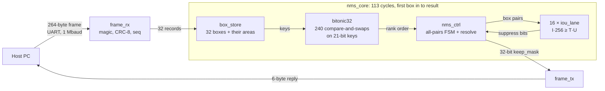

# Deterministic NMS in hardware

[](https://github.com/YutharsanS/hardware-accelerated-nms-algorithm/actions/workflows/ci.yml)

**Non-Maximum Suppression for up to 32 bounding boxes in exactly 113 cycles — 1.13 µs at 100 MHz —
for every batch, whatever the boxes are.** A bitonic sorting network and 16 parallel IoU lanes, in
VHDL, on a Digilent Basys 3 (AMD Artix-7 XC7A35T), with the 80-cycle compute core measured on
silicon.

- **Faster than software in the worst case.** The block's worst case is its only case: 1.13 µs.
  That is **3.4× faster than the 99th-percentile time of compiler-optimised C on a 4.7 GHz Intel
  core**, and 4.7× faster than C's slowest call observed.
- **Far ahead of the NMS that pipelines actually call.** On a Raspberry Pi 4 the block beats every
  software implementation tested, on all but one degenerate input: **~170× torchvision's median,
  and up to ~1,300× its tail** under load.
- **Deterministic, measured.** Load moves every software implementation — it doubles OpenCV's and
  torchvision's medians on the Pi 4 and pushes torchvision's p99 to 6× idle. It never moves the
  block: an on-chip logic analyser measured **80 cycles in 16 of 16 different batches**.
- **Bit-exact.** Every result matches a Python golden model as a single 32-bit equality: under two
  simulators, and on 1,000 random batches on the board.


---

## Results

Hostile stream (1,000 varied batches of 32 boxes), one core and one thread per software call, every
answer checked against its reference before it was timed. Median / p99 µs per NMS call:

| implementation | laptop, i5-13500H at 4.7 GHz | Raspberry Pi 4, Cortex-A72 at 1.8 GHz | Pi 4, worst p99 under load |
|---|---|---|---|
| C, compiler-optimised (`-O3 -march=native`) | 1.89 / 3.79 | 8.89 / 11.7 | 14.2 |
| OpenCV `cv2.dnn.NMSBoxes` | 8.77 / 13.6 | 35.7 / 44.1 | 86.7 |
| torchvision `ops.nms` (what Ultralytics YOLO calls) | 17.7 / 27.1 | 195 / 222 | 1,442 |
| **this block, 100 MHz** | **1.13 / 1.13** | **1.13 / 1.13** | **1.13** |

"Under load" is the worst of three conditions: a YOLOv8n inference before every call (a real
detection pipeline), YOLOv8n in another process, and a `stress-ng` memory load. The block's time
is the same for every batch of up to 32 boxes, so it has no separate median, tail or load figure.


**T on silicon.** The ILA capture: `start` to `done` in 80 cycles; all 16 captured batches measure
the same.


The full evaluation — method, platforms, every input group, repeatability, and what the numbers do
and do not support — is in **[docs/results/benchmarks.md](docs/results/benchmarks.md)**.

---

## How it works



1. **The sorter ranks all 32 boxes at once** — highest score first — in a bitonic network of 240
   compare-and-swap units, pipelined into 8 cycles.
2. **Sixteen IoU lanes test every pair in parallel**, before any keep/discard decision is made.
3. **A resolve pass walks the ranking once**, applying those results. A suppressed box can never
   come back, so precomputing every pair gives the same answer as the textbook sequential loop —
   and the golden model checks that it does.

Four decisions explain most of the design (all frozen in
[architecture.md](docs/design/architecture.md)):

- **Integers only.** Confidence is a 16-bit score; the IoU threshold 0.5 is `T_INT = 128` in units
  of 1/256.
- **Never divide.** `IoU ≥ 0.5` is rearranged into `I × 256 ≥ T_INT × U`: multiplies and a compare.
  It is exact, and it gives a defined answer even for zero-area boxes.
- **Sort keys, not boxes.** Only a 21-bit key moves through the sorter — the score with the
  inverted slot index appended — while the 64-bit boxes stay put. Because indices are unique, no
  two keys are ever equal, so ties break the same way every time and the network's instability can
  never show.
- **No data-dependent step.** The schedule is fixed, so latency is an equality:
  `T = N²/P + L + I + C + 2 = 80` cycles at P = 16 lanes, plus 32 cycles to load and 1 to settle.

The plain-language version is the [NMS primer](docs/design/nms_primer.md).

---

## Verified, and what it costs

| | |
|---|---|
| **Correctness** | bit-exact against the Python golden model, a single 32-bit equality, in GHDL and in Vivado xsim; T, load and settle pinned as equalities on every simulated batch |
| **On the board** | 20 / 20 committed frames byte-exact, **1,000 / 1,000** random batches bit-exact, corrupted frames rejected |
| **On silicon** | T = 80 cycles in **16 of 16** ILA-captured batches |
| **Area** (XC7A35T) | 12,570 LUT (60.4%), 9,979 FF (24.0%), 33 DSP, 0 BRAM |
| **Timing** | 100 MHz, setup slack +0.200 ns, hold +0.043 ns |

Every figure is in [docs/results/hardware.md](docs/results/hardware.md).

---

## Quickstart

```bash
sudo apt install ghdl gtkwave build-essential
uv sync
make test                         # lint, the Python suite and all 10 VHDL testbenches (~1.5 min)
```

With Vivado 2026.1 and a Basys 3:

```bash
source ~/Vivado/2026.1/Vivado/settings64.sh
make impl && make program         # build and load the bitstream
make host                         # check it from the host: 20 frames, byte-exact
make bench                        # benchmark software NMS on this machine
```

Everything else — waveforms, synthesis, the ILA capture, the benchmark loads — is in the
**[user guide](docs/user_guide.md)**.

---

## Repository

```text
src/components/    datapath and link blocks: nms_pkg, cas, bitonic32, iou_lane, box_store,
                   nms_ctrl, uart_rx, uart_tx, frame_rx, frame_tx
src/pipeline/      nms_core (the compute core) and nms_top (the Basys 3 top)
test/              self-checking VHDL testbenches (tb_*.vhd), and a simulation stub for the ILA IP
models/nms/        golden model, frozen constants, test vectors, wire format, host program
models/data/       committed test vectors
benchmarks/        the software benchmark harness, the on-chip latency checker, and every result
scripts/           Makefile rules and Vivado Tcl (synthesis, implementation, programming, ILA)
deployment/        Basys 3 constraints
docs/              the documentation, below
explorations/      side studies: the early 3D Gaussian Splatting measurements
tests/             repository checks (every documentation link resolves)
```

| | |
|---|---|
| [docs/user_guide.md](docs/user_guide.md) | build, verify, program, run and benchmark |
| [docs/design/](docs/design/) | the [primer](docs/design/nms_primer.md), the normative [architecture spec](docs/design/architecture.md), the [control FSM](docs/design/fsm_design.md) |
| [docs/results/](docs/results/) | the [benchmarks](docs/results/benchmarks.md) and the [hardware results](docs/results/hardware.md) |
| [docs/project/](docs/project/) | the [build log](docs/project/build_log.md) and [future work](docs/project/future_work.md) |

---

## Scope

The claims above hold under these conditions, stated so they can be checked:

- **The UART is a test harness.** A round trip over it takes ~5 ms, against the core's 1.13 µs,
  so on the Basys 3 the block demonstrates latency and determinism, not a system speed-up. It is
  designed as an IP beside a detector inside the FPGA fabric; that integration is
  [future work](docs/project/future_work.md).
- **Up to 32 boxes per batch, one class per batch.** That is the target application's constraint;
  on generic COCO scenes about 10% of per-class batches exceed 32.
- **16 IoU lanes, fixed.** The lane count is a generic, but only P = 16 was implemented and measured.
- **The competitors.** The C is compiler-optimised portable C, not hand-written SIMD, on one core;
  on single easy batches, laptop C is faster than the block (0.21–1.10 µs). The embedded comparison
  is a Raspberry Pi 4, not the faster Pi 5.
- **What is measured where.** T = 80 cycles is measured on silicon; the 32 load cycles and 1 settle
  cycle of the 113 are pinned as equalities in simulation.

## Authors

[dewminawijekoon](https://github.com/dewminawijekoon) and [YutharsanS](https://github.com/YutharsanS),
University of Moratuwa.

## Licence

MIT — see [LICENSE](LICENSE).
