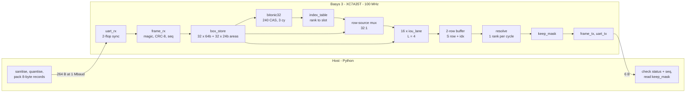
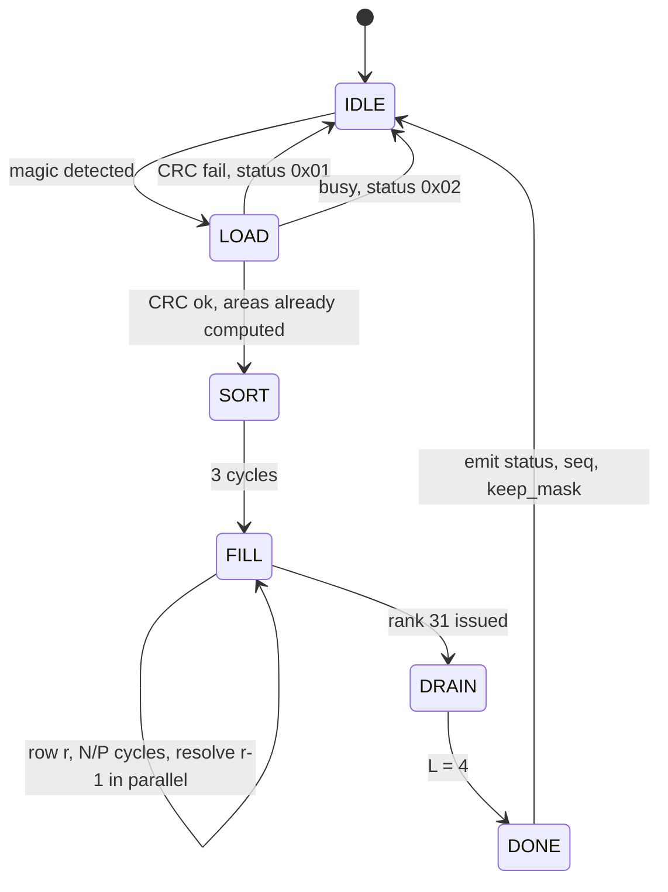

08/31/2026

Target video frame (max) : 1080P - 1920 x 1080

Determines the upper bound for the coordinates (integers) 

$log_2(1920) \approx$ $log_2(1080) \approx 11\text{bits}$

So, the minimum data width we need is **22 bits** per coordinate (x, y) 
- 2 coordinate points (2 x 22 bits) and 16 bit confidence score = 60 bits per bounding box, doesn't quite fit standard byte offset
- **2 coordinate points (2 x 24 bits) and 16 bit confidence score = 64 bits per boudning box (8 bytes).**
**Fits the standard byte offset**

Payloads live in **registers, not Block RAM**: at the adopted P=16 lanes, the datapath needs
768 bits/cycle of coordinates, and a BRAM36 delivers at most 72 b/cycle per port, so BRAM cannot
feed the lanes at all. The 32-box batch is held in 32 x 64 b payload registers (2,048 FF, 4.9%)
plus 32 x 24 b precomputed-area registers (768 FF) — see `docs/plan.md` Q23.

- - -

- Confidence score: **16 bits** (u16, `score = round(f * 65535)`, Q16). The IoU threshold
  itself is a separate fixed synthesis-time generic, `T_INT` — **8 bits** (u8, Q0.8 fixed point,
  `T_INT = 128` means a threshold of `128/256 = 0.5`; see `docs/plan.md` Q11).
- The LHS and RHS sides should be able to compare **33 bits** values

# Basys 3: AMD Artix™ 7 FPGA Trainer Board

## Features
* On-chip analog-to-digital converter (XADC)

---

## Key Specifications

| Specification | Details |
| :--- | :--- |
| **FPGA Part #** | XC7A35T-1CPG236C |
| **Logic Cells** | 33,280 (in 5,200 slices) |
| **Block RAM** | 1,800 Kbits |
| **DSP Slices** | 90 |
| **Internal Clock** | 450 MHz+ |
| **Quad-SPI Flash** | 4 MB |

---

## Connectivity and Onboard I/O

| Peripheral | Count / Details |
| :--- | :--- |
| **Pmod Connectors** | 3 |
| **User Switches** | 16 |
| **Push Buttons** | 5 |
| **User LEDs** | 16 |
| **7-Segment Display**| 4-Digit |
| **VGA Port** | 12-bit |
| **USB** | HID Host (Keyboard, Mouse, Mass Storage) |

---

## Electrical Specifications

* **Power Sources:** USB or 5V external supply (via pins)
* **Logic Level:** 3.3V

---

## Physical Dimensions

* **Width:** 2.8 in
* **Length:** 4.8 in

---

# Frozen interface spec (normative)

This section is `docs/plan.md` Part 2 in full — the frozen wire protocol, datapath widths,
sanitisation contract, architecture and control FSM for the NMS accelerator. It is normative:
`models/nms_params.py`, `models/nms_model.py` and the eventual RTL all implement exactly this.
See `docs/plan.md` Part 1 for the derivation of every number here (Q1-Q24) and Part 1e/1d for
why the all-pairs, rank-ordered structure was chosen.

## Record and wire protocol

**One byte-order rule, no exceptions: every multi-byte field is transmitted MSB-first.** Host
uses `int.from_bytes(b, "big")` in both directions.

| bits | 63:52 | 51:40 | 39:28 | 27:16 | 15:0 |
|---|---|---|---|---|---|
| field | `x` | `y` | `a` | `b` | `score` |

| direction | bytes | content |
|---|---|---|
| host → FPGA | 0..1 | `magic` = `0xA5 0x5A` |
| host → FPGA | 2..257 | 32 records, 8 B each. Slot *i* = the *i*-th record. |
| host → FPGA | 258..261 | `present_mask`, 4 B |
| host → FPGA | 262 | `seq`, 1 B — frame counter, wraps at 256 |
| host → FPGA | 263 | **CRC-8** over bytes 2..262 |
| FPGA → host | 0 | `status`: `0x00` OK, `0x01` CRC fail, `0x02` busy, `0x03` internal error |
| FPGA → host | 1 | `seq` echoed, so a late reply can never be mis-attributed |
| FPGA → host | 2..5 | `keep_mask`, 4 B (zero when `status ≠ 0`) |

**264 bytes in, 6 out.** A plain byte counter is *not* sufficient framing: one dropped or
spurious byte would desynchronise permanently, corrupting every subsequent frame in a way that
looks exactly like an RTL bug. The magic word gives resynchronisation, the CRC-8 rejects corrupt
frames before they reach the datapath, and an **idle timeout** (no byte for > 2 byte-times
mid-frame) returns the receiver to hunting. Cost: 3 bytes (1.1% of the frame) and a small FSM.

**`present_mask`** — bit *i* = "slot *i* holds a real detection". Its sole use is as the **load
value of `valid_mask`** at start-of-batch instead of all-ones. An absent slot is therefore never
a keeper and never dispatched; since `keep_mask` resets to 0, its output bit is provably 0.
`present_mask=0` is well-defined (terminate immediately, `keep_mask=0`). All 32 slots are
transmitted regardless — only the mask says which are meaningful — which is what keeps the frame
fixed-length and removes the padding/duplicate-zero-score problem structurally.

**`keep_mask`** — bit *i* = "the *i*-th box you sent survived". Both masks are indexed by
**arrival order**, so the host never reorders and the testbench check is a **single 32-bit
equality**.

## Datapath widths

| Signal | Sign | Width | Max | Note |
|---|---|---|---|---|
| `x, y, a, b` | u | 12 | 4095 | |
| `bw, bh` | u | 12 | 4095 | clamped `(a>x) ? a-x : 0` |
| `area1, area2` | u | 24 | 16,769,025 | per box, precomputed |
| `xx, yy, aa, bb` | u | 12 | 4095 | min/max |
| `t_w, t_h` | **s** | 13 | ±4095 | signed intermediate |
| `w, h` | u | 12 | 4095 | clamp to 0 |
| `I = w*h` | u | 24 | 16,769,025 | 1 DSP |
| `U = area1+area2−I` | u | 25 | 33,538,050 | via s26 intermediate |
| `LHS = I << 8` | u | 32 | 4,292,870,400 | |
| `RHS = T_INT * U` | u | 33 | 8,552,202,750 | 0 DSP at T=128 |
| compare | | 33 | | zero-extend LHS |

## Host sanitisation contract

The FPGA trusts nothing, but the host is responsible for producing a well-formed batch. Both the
synthetic generator and the later detector front-end implement the identical sequence:

1. **Confidence threshold** — drop boxes below a cutoff. A `Θ(n)` filter, **never a sort**; this
   is what keeps the accelerator's premise intact.
2. **Cap at 32** — if more than 32 survive, take 32. Document the rule used (highest confidence
   first is a partial selection, not a full ordering).
3. **Clamp coordinates** into `[0, 4095]` and enforce `a > x`, `b > y`; drop or repair violators.
   The hardware clamps anyway, so this is defence in depth, not a correctness dependency.
4. **Quantise** — `score = round(f × 65535)`.
5. **Set `present_mask`** — bit *i* for each real box; pad the remaining slots with anything.
6. **Frame** — magic, 32 records, `present_mask`, `seq`, CRC-8.

Steps 3–6 are shared code between `models/gen_vectors.py` and the eventual detector front-end,
so the demo path and the verification path cannot drift.

## Architecture

- **Sorter** `bitonic32`: standard schedule `for kk in {2,4,8,16,32}, for jj = kk/2 downto 1, for
  i in 0..31 where (i and jj)=0`, partner `i xor jj`, `dir_desc = '1' when (i and kk) /= 0`. 15
  sub-stages × 16 CAS = **240 CAS on 21-bit keys**, `PIPE_CUTS=2` → 3 cycles. Output is
  **ascending**, so the rank table reads reversed: `index_table(r) = idx(out(31−r))`.
- **Suppression rows** `S(r)(j)` = "the rank-`r` box suppresses the box in slot `j`", produced
  one row per rank, `P` columns per cycle. **The 32×32 matrix is a conceptual model, not a
  storage requirement:** rows are produced in rank order and consumed by resolve in rank order
  one cycle later, so the physical structure is a **2-row streaming buffer (~74 FF)**.
- **Carry `idx_r` alongside each row through that buffer**, so `index_table` never needs a
  second read port.
- **Lanes**: `P` generic, **default 16**, `P ∈ {1,2,4,8,16,32}`. Lane *j* owns matrix columns
  j, j+P, j+2P, …, so each lane muxes 32/P payloads instead of a 32:1 crossbar.
- **Lane pipeline, L=4**: (1) min/max + subtract + clamp; (2) `I = w*h` DSP; (3) `U`, `RHS`,
  `LHS`; (4) 33-bit compare → `suppress`.
- **Masks** `valid_mask` / `keep_mask`, both in original-index space, updated by the resolve
  loop.
- **FSM** `IDLE → LOAD → SORT(3) → FILL(N·⌈N/P⌉, resolve overlapped) → DRAIN(L) → DONE`. Areas
  are computed during `LOAD` as each record lands, so they cost no cycles. `FILL` issues row `r`
  for `r = 0..31` in **rank order** — `src = payload[index_table(r)]`. **Resolve**, one rank per
  cycle, trailing the fill by `L`:
  `if valid_mask(idx_r) then keep_mask(idx_r) <= '1'; valid_mask <= valid_mask and not S(r); end if`,
  then always clear `valid_mask(idx_r)`. `DONE` after rank 31 resolves — **always exactly
  `N²/P + L + C + 2` cycles, no data dependence.**
- **Conventions**: single 100 MHz domain (pin W5), synchronous active-high `rst` from a
  debounced BTNC plus power-on reset, `ieee.numeric_std`.

## Dataflow

Only `{score, index}` traverses the sorter (21 bits). Payloads never move — they sit in
`box_store` and are read by column, which is what makes static lane binding possible.

## Control FSM

Every path from `SORT` to `DONE` is a fixed-length counter walk — no trip count depends on the
data, which is why latency is an equality rather than a bound.

## Area budget at P=16

| block | LUT | FF | DSP |
|---|---|---|---|
| `bitonic32` (PIPE_CUTS=2) | 7,200 | 1,344 | 0 |
| 16 × `iou_lane` (≈214 LUT ea.) | 3,424 | ~2,400 | 16 |
| row-source payload mux (32:1 × 48 b) | 530 | — | 0 |
| row-source area mux (32:1 × 24 b) | 264 | — | 0 |
| 2-row streaming buffer + `idx_r` | — | 74 | 0 |
| payload + area registers | — | 2,816 | 1 |
| `index_table` | — | 160 | 0 |
| masks, resolve, FSM, UART, packer | ~900 | ~450 | 0 |
| **total** | **≈12,320 (59%)** | **≈7,240 (17%)** | **17 (19%)** |

Full derivation, the P-sweep, the language/toolchain policy, and the answered questions this
spec rests on are in `docs/plan.md` Parts 1 and 2.
