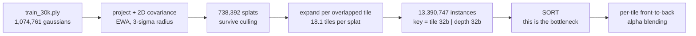

# Phase 0 findings — is 3DGS depth sorting a real problem, and can this board host it?

Measured on the Tanks & Temples **`train`** scene (1,074,761 Gaussians, SH degree 3,
`iteration_30000`) at 1920×1080 with 16×16 tiles, on an i5-13500H. All code under
[`models/gs/`](../models/gs/); reproduce with the commands in [Reproducing](#reproducing).

## Verdict

| question | answer |
|---|---|
| Is the sort a real bottleneck? | **Yes.** CPU needs 504–662 ms against a 33 ms frame budget — **15–20× over**. |
| Is a bitonic network the right primitive? | **Yes.** A full sort is required; early termination saves nothing. |
| Is the existing N=32 design sized correctly? | **Not as a whole sorter — 49× too small.** It is the right *block-sort primitive* inside a streaming merge sorter. |
| Can a Basys 3 host it? | **A per-tile sorter, yes** — and at 12-bit depth keys, four lanes reach **30 fps**. It cannot hold or be fed a whole frame. |
| Is the projection trustworthy? | **Yes** — verified by rendering the scene (§6). |

This is the opposite of the NMS finding, where a CPU did the whole job in 0.14% of a frame.
There, the sorter was 10× more expensive than the argmax tree that would replace it; here the
sort is unavoidable and the CPU is 15–20× too slow.

## The workload



**13,390,747 instances per frame**, 18.1 per splat — consistent with the 5–20 range reported
for real scenes, which is the main evidence that the reimplemented projection is faithful.

## 1. The sort is genuinely expensive

| implementation | cost per frame | vs 33 ms budget |
|---|---|---|
| CPU, global 64-bit key sort (`np.sort`) | **662 ms** | 19.9× over |
| CPU, per-tile depth sorts (8,160 tiles) | **504 ms** | 15.1× over |
| GPU, CUB device radix at 4K *(literature)* | 2.5–4.2 ms | real-time |

## 2. A full sort is required — early termination does not rescue you

Blending stops a pixel once transmittance drops below `1e-4`, so a top-K selector would be
enough *if* tiles saturated early. Measured over 150 sampled tiles, evaluating the real 2D
Gaussian at every 4th pixel and reducing with a **max** (a tile may only stop once *every*
pixel has saturated):

| | occupancy | consumed | fraction |
|---|---|---|---|
| median | 1,524 | 857 | **92.0%** |
| mean | 1,568 | 887 | 74.3% |
| 90th pct | 3,060 | 1,692 | 100.0% |
| max | 5,415 | 2,451 | 100.0% |

Only **56.7%** of tiles had every sampled pixel saturate at all; the rest consume the entire
list. A top-K selector would need K ≈ 857 (median) to 2,451 (max) against occupancies of
1,524 to 5,415 — no useful saving.

**This closes the question that could have overturned the architecture.** Unlike NMS, where a
31-comparator argmax tree made the sorter redundant, here the sorting network is
*architecturally required*. It also matches the published accelerators, which all build their
sorting units on bitonic networks.

## 3. The current design is sized wrong by ~50×

Median occupied tile holds **1,577** instances:

| N | undersize vs median tile | share of total work a size-N pass covers |
|---|---|---|
| **32** | **49.3×** | **0.00%** |
| 64 | 24.6× | 0.01% |
| 128 | 12.3× | 0.1% |
| 256 | 6.2× | 2.1% |
| 512 | 3.1× | — |

A 32-element network — the entire premise of the existing design — covers essentially none of
the work. The target is **N ≈ 512–2048 per tile**, or a streaming merge architecture with a
small bitonic network as its *primitive* rather than the whole sorter.

## 4. What the board can and cannot do

| requirement | value | Basys 3 |
|---|---|---|
| Largest single tile working set | **61 KB** | **fits** (225 KB BRAM) |
| Whole-frame working set | **107 MB** | **no** — no DRAM on the board |
| Throughput for 30 fps | **402 M elements/s** = **4.02 per cycle** at 100 MHz | a 1 elem/cycle sorter gives **25%** |
| Feeding 107 MB/frame over UART @12 Mbaud | ~71 s/frame | **no** |

So **per-tile (hierarchical) sorting is hostable** — which is exactly the optimisation GSCore
identifies, here confirmed independently by measurement — while whole-frame sorting is not, and
the board cannot be fed a frame over any link it has.

## 5. Framing sensitivity, and why it matters

No camera poses ship with the `.ply`, so views are synthesised by orbiting the scene's dense
core. The absolute workload depends strongly on how tightly the subject is framed, so the
conclusion was checked across framings:

| core quantile | camera distance | instances | per splat | median tile | max/median | N=32 work |
|---|---|---|---|---|---|---|
| 0.50 | 5.8 | 13.8 M | 26.5 | 1,655 | 2.9 | 0.00% |
| **0.70** | **6.9** | **13.4 M** | **18.1** | **1,577** | **4.8** | **0.00%** |
| 0.80 | 11.8 | 8.2 M | 9.3 | 494 | 23.1 | 0.10% |
| 0.90 | 39.9 | 3.5 M | 3.4 | 128 | 408.5 | 0.41% |

Two things follow. The **N=32 conclusion is robust** — it covers under 0.5% of the work at every
framing. But the *shape* changes: the "two orders of magnitude variance" the literature
describes appears only at wide framings, where most tiles are near-empty background. At the
close framings that match a real capture rig, occupancy is fairly **uniform but uniformly
enormous** (max/median ≈ 3–5, median ≈ 1,600). The design problem is therefore **scale, not
variance** — which is the opposite of what was expected going in.

## 6. The projection is verified, not merely plausible

The unit checks confirm exact depths, on-axis radii and screen centres, but they cannot catch
an error that is self-consistent yet wrong — a transposed covariance, a flipped axis, a bad
quaternion convention. So the per-tile sorted lists were alpha-blended into an image:


Legible "WESTERN PACIFIC" lettering, correct occlusion and correct colour. A subtle error in
the covariance, conic or tile assignment could not produce readable text. **The preprocess
stage is correct**, so every number in this document rests on a verified projection.

## 7. Key width: 12–16 bits of depth is enough, and it is a throughput lever

The reference packs a full float32 depth into the sort key. Narrowing it shrinks every
comparator and swap mux, so it directly buys sorter lanes. Rendering with the exact key and
with a quantised key, then measuring PSNR, gives the honest cost:

| depth bits | scheme | intra-tile ties | PSNR vs float32 |
|---|---|---|---|
| 8 | z | 37.8% | 22.7 dB |
| 8 | 1/z | 40.9% | 24.2 dB |
| 12 | z | 5.3% | 34.9 dB |
| **12** | **1/z** | **6.8%** | **35.6 dB** |
| **16** | **1/z** | **0.5%** | **52.7 dB** |
| 20 | 1/z | 0.03% | 65.6 dB |

`1/z` beats linear `z` at every width despite creating slightly *more* ties, because it spends
its precision in the near field where occlusion actually decides the pixel.

| 12-bit — 35.6 dB | 8-bit — 24.2 dB |
|---|---|
|  |  |

12-bit is visually indistinguishable at this scale; 8-bit visibly smears the lettering and
edges. So the usable floor is **12 bits**, with **16 bits** the conservative choice.

### What that buys in hardware

A monolithic bitonic sorter for a whole tile is impossible — folded at N=2048 it is **305% of
the device**. The architecture that fits is a **streaming merge sorter**: a 32-element bitonic
network sorts blocks, a binary merge tree combines them at one element per cycle. The
32-element network the earlier NMS design already specified becomes the *primitive*.

| depth bits | key width | CAS LUT | lane LUT | lanes that fit | throughput | fps on this scene |
|---|---|---|---|---|---|---|
| 32 (float) | 45 | 62 | 7,633 | 2 | 200 M/s | 15 |
| **16** | 29 | 38 | 5,217 | 3 | 300 M/s | 22 |
| **12** | 25 | 32 | 4,613 | **4** | **400 M/s** | **30 — real-time** |

**Against a CPU baseline of 1.98 fps** (504 ms per frame), even a single lane is 3.8× faster,
and 12-bit keys at four lanes reach the 30 fps requirement outright. This is the result the
project was looking for: a real bottleneck, the right primitive, and a measured quality/
throughput curve rather than an asserted speedup.

Worth noting for the report: 3DGS itself reconstructs these scenes at roughly 22–25 dB PSNR
against ground-truth photographs, so a 35.6 dB perturbation of its *own* output sits well
below the method's inherent error. That is the argument for spending 12 bits rather than 32 —
but it should be checked against the paper's reported figures before being relied on.

## Caveats

- **One scene, synthesised views.** No camera poses shipped, so framing is inferred; §5 bounds
  the sensitivity but a second scene would strengthen it.
- **The projection is validated, not verified against the reference.** With no NVIDIA GPU the
  CUDA rasterizer cannot be run. It is checked against hand-computed values on synthetic scenes
  (exact depths, on-axis radii, exact screen centres, and the 64-bit key ordering matching
  `lexsort`), and its 18.1 instances-per-splat lands in the published range. Step 0.3 (render an
  image and compare) remains outstanding.
- **The CPU baseline is numpy, not tuned C.** A radix sort in C would be several times faster,
  so treat 504–662 ms as an upper bound on CPU cost. The 15–20× overshoot has enough margin to
  survive that, but the GPU figure is cited, not measured locally.

## Reproducing

```bash
python -c "
import sys; sys.path.insert(0,'models')
from gs import load_ply as lp, project as pj, cameras as cm, tile_stats as ts, sort_cost as sc, early_term as et
s = lp.load_gaussians('models/data/scenes/train_30k.ply')
cam = cm.orbit(cm.robust_core(s.means, quantile=0.7), n_views=1, elevations_deg=(0.0,))[0]
sp, inst = pj.preprocess(s, cam)
print(ts.format_report(ts.per_frame_stats(inst, cam)))
print(sc.format_report(sc.measure(inst, cam, len(sp))))
print(et.format_report(et.measure(sp, inst, cam)))
"
```

The scene is not committed (267 MB, gitignored). Fetch it from
[Voxel51/gaussian_splatting](https://huggingface.co/datasets/Voxel51/gaussian_splatting):

```bash
curl -L -o models/data/scenes/train_30k.ply \
  "https://huggingface.co/datasets/Voxel51/gaussian_splatting/resolve/main/FO_dataset/train/point_cloud/iteration_30000/point_cloud.ply"
```
