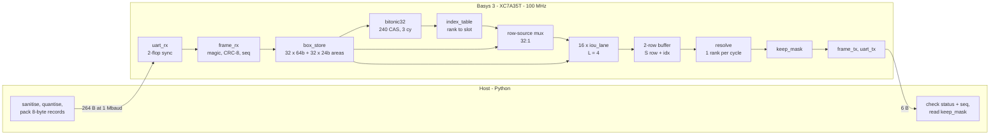
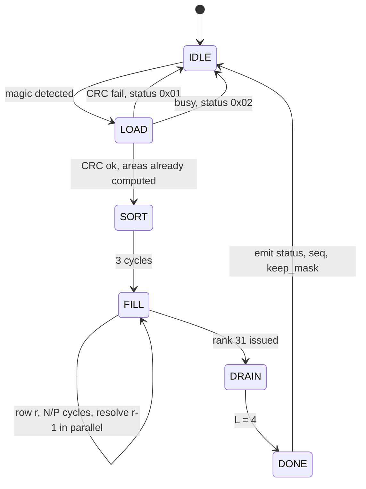
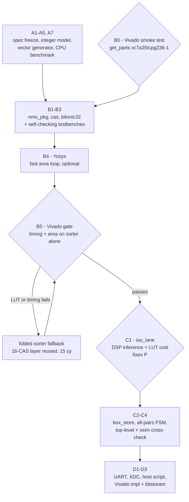
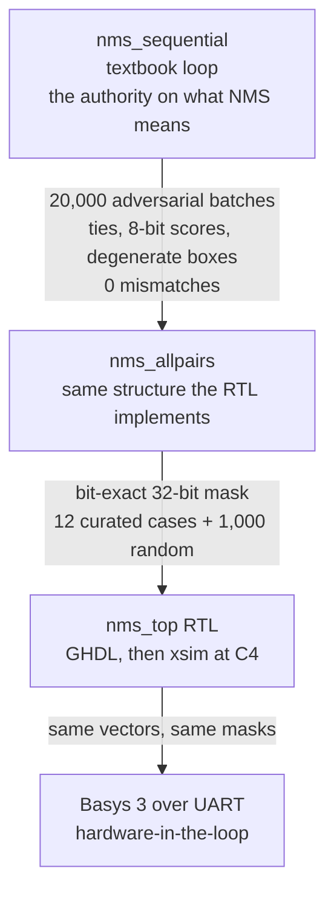

# Bitonic sorting network for 3D Gaussian Splatting — exploration plan

## Why this plan changed

The project was scoped as an NMS accelerator. Fully specifying it — and then measuring rather than
assuming — showed the premise does not hold:

- **There is no bottleneck to remove.** At N=32 a CPU does NMS in **47 µs = 0.14% of a 33 ms frame**
  (measured on this machine, i5-13500H).
- **The accelerator makes the system slower.** Behind the UART: 868 µs versus the CPU's 83 µs — a
  **10× regression**. Transfer is O(N) at 20 µs/box while CPU compute is O(N²) at 0.067 µs/pair, so
  no baud rate fixes it; the crossover is N ≈ 600, well past what the board holds.
- **It does not even win on energy.** At a 0.003% duty cycle the XC7A35T's static power (~7–16 mJ
  per frame) dwarfs the ~0.5 mJ the CPU spends on the NMS.

Meanwhile this repository is named `bitonic-sorting-network-**3dgs**`, and in 3D Gaussian Splatting
the sort genuinely dominates: [GSCore (ASPLOS 2024)](https://dl.acm.org/doi/10.1145/3620666.3651385)
measures the sorting stage at **up to 90.8% of GPU bandwidth** and builds its Sorting Unit on **a
bitonic network**; [REACT3D](https://dl.acm.org/doi/10.1145/3725843.3756109) and
[STREAMINGGS](https://arxiv.org/pdf/2506.09070) do the same. And a **full sort is architecturally
required** there — alpha blending must proceed front-to-back — so the sorter-versus-argmax tension
that undermined the NMS design disappears.

**So: Part 0 gathers this project's own 3DGS data before committing.** The Appendix keeps the NMS
design intact — its sorter half transfers unchanged, and its measurements are the evidence for
pivoting.

| § | What it settles |
|---|---|
| **Part 0** | **3DGS exploration — the live work. Seven Python files, 2–3 days, no RTL.** |
| Appendix | The complete NMS design: frozen spec, all-pairs architecture, 11 pitfalls, 8 loopholes, and the critical evaluation record. Reusable and retained as evidence. |

**Start here — three steps, in order.**

1. **0.1–0.3**: load a pretrained 3DGS `.ply`, reimplement the projection and tile assignment in
   numpy, then *validate it by rendering an image*. Everything downstream is worthless if the
   projection is subtly wrong.
2. **0.4 and 0.6**: the per-tile histogram and the early-termination analysis. Between them they
   choose `N` and decide whether a full sort is even the right primitive.
3. **Decide the pivot** from the table at the end of Part 0. If it goes ahead, the Appendix's sorter
   work (`cas`, `bitonic32`, `PIPE_CUTS`, folded fallback, the Vivado gate strategy, the VHDL-93
   language policy) is reused with `(depth, index)` keys.

**Worth 30 seconds at any point:** `source ~/Vivado/2026.1/Vivado/settings64.sh` then check
`get_parts xc7a35tcpg236-1` returns 1 — every synthesis gate in either direction depends on it, and
the install carries only an Alveo licence.

## Part 0 — 3DGS exploration: gather the data, then decide the pivot

> **The project direction is under review.** Measurement showed the NMS framing accelerates a
> non-bottleneck: at N=32 a CPU does NMS in **47 µs = 0.14% of a 33 ms frame**, and behind the UART
> the accelerated system is **10× slower** than not accelerating at all. Meanwhile the repository is
> named `bitonic-sorting-network-**3dgs**`, and in 3D Gaussian Splatting the sort *is* the
> bottleneck — [GSCore (ASPLOS 2024)](https://dl.acm.org/doi/10.1145/3620666.3651385) measures the
> sorting stage at **up to 90.8% of GPU bandwidth**, builds its Sorting Unit on **a bitonic network**,
> and [REACT3D](https://dl.acm.org/doi/10.1145/3725843.3756109) and
> [STREAMINGGS](https://arxiv.org/pdf/2506.09070) do the same.
>
> **Parts 1–6 below stay intact and on hold.** Everything in them about the sorter — `cas`,
> `bitonic32`, `PIPE_CUTS`, the folded fallback, the sort-keys-not-payloads insight, tie-breaking by
> index, the Yosys→Vivado gate strategy, the bit-exact verification discipline — transfers unchanged
> to a 3DGS depth sorter. Only the key changes, from `(score, index)` to `(depth, index)`, and only
> the IoU/NMS datapath would be dropped.

### Why data first

The papers give the *shape* of the problem, not this project's numbers. Two findings in particular
must be measured before choosing an architecture:

- The reference renderer assigns each splat-tile instance a **64-bit key — low 32 bits depth, high
  bits tile index** — over **16×16 pixel tiles**, and resolves all ordering in **one CUB radix sort**
  (2.5–4.2 ms per frame at 4K). Per-tile *hierarchical* sorting is GSCore's key optimisation, and a
  tile holds on the order of 10²–10³ Gaussians — the size a Basys 3 can actually own.
- The literature reports Gaussians-per-tile varying by **two orders of magnitude**, which makes
  *fixed-parallelism* sorting modules idle on small tiles and bottleneck on large ones. **A bitonic
  network is exactly a fixed-parallelism sorter.** That tension is the project's real research
  question, and answering it needs the actual histogram.

**Hardware constraint:** this machine has **no NVIDIA GPU** (Intel Iris Xe only), so the CUDA
reference rasterizer cannot be run. The exploration therefore reimplements the rasterizer's
*preprocess* stage in numpy — which is the right tool anyway, since that code doubles as the golden
model for the eventual RTL.

### Phase 0 deliverables

| # | File | Action |
|---|---|---|
| 0.1 | `models/gs/load_ply.py` | Parse a pretrained 3DGS `.ply` with numpy — binary little-endian, properties `x,y,z`, `opacity`, `scale_0..2`, `rot_0..3` (skip `f_dc_*`/`f_rest_*`; only geometry and opacity are needed). Read the ASCII header, then one structured-dtype `fromfile`. No `torch`, no `plyfile` dependency required. |
| 0.2 | `models/gs/project.py` | Reimplement the reference preprocess: world→camera transform, frustum cull, perspective-project the means, build the 3D covariance from scale + rotation quaternion, project to 2D covariance through the projection Jacobian (EWA splatting), take the 3σ screen-space radius, and emit `(tile_id, depth, gaussian_index)` instances over a 16×16 tile grid. |
| 0.3 | `models/gs/validate.py` | **Correctness gate — the histogram is worthless if the projection is wrong.** Two checks: (a) mean tiles-touched per Gaussian should land in the published ~5–20 range; (b) render a low-resolution image (e.g. 400×300) by actually alpha-blending the sorted per-tile lists, and compare against the scene's reference view. If the image looks like the scene, the projection and tile assignment are right. |
| 0.4 | `models/gs/tile_stats.py` | **The headline artifact.** Histogram of instances per tile, across several camera poses. Plus a **coverage table**: for N ∈ {32, 64, 128, 256, 512, 1024}, what fraction of *tiles* fit in N, and what fraction of *instances* those tiles hold. This is what picks N. |
| 0.5 | `models/gs/sort_cost.py` | Measured CPU baseline on this machine: per-tile `argsort` summed over tiles, versus one global `lexsort` on the composite 64-bit key. Sanity-check the global figure against the published 2.5–4.2 ms @4K. |
| 0.6 | `models/gs/early_term.py` | **The partial-sort question.** Walk each tile front-to-back accumulating transmittance `T *= (1-α)` and record how many Gaussians are consumed before `T < 1e-4` (the reference threshold). If tiles typically saturate after a small fraction of their list, **a full sort is wasteful and a top-K/partial sorter is the better architecture** — which would change the RTL substantially. |
| 0.7 | `models/gs/key_width.py` | Feeds the area model directly: how much depth precision is needed before ordering artifacts appear (reference uses 32-bit float — can 16-bit fixed do?), plus index width = `ceil(log2(max instances))`. Total key width sets the CAS width, which sets LUT cost via the existing `8 + 2·⌈W/2⌉` model. |

**Inputs needed:** one pretrained 3DGS scene `.ply` (a Tanks & Temples scene such as `truck` is ~1M
Gaussians / ~250 MB; Mip-NeRF 360 scenes are larger). 27 GB free is ample. Camera poses come from
the scene's `cameras.json` if shipped, otherwise construct a view looking at the point-cloud
centroid.

### The decision Phase 0 produces

| question | answered by | feeds |
|---|---|---|
| What `N` should the sorting network target? | 0.4 coverage table | sorter size, area budget |
| Pad-to-`N`, bucket by size, or hybrid? | 0.4 histogram variance | architecture choice |
| Full sort, or top-K / partial? | 0.6 early-termination | whether the bitonic network is even the right primitive |
| Key width, hence CAS width and LUT cost | 0.7 | the Part 1 area model, reused verbatim |
| Is the FPGA competitive at all? | 0.5 vs the cycle model | go / no-go on the whole pivot |

**Cost: 2–3 days**, all Python, no RTL, no hardware. It either justifies the pivot with this
project's own numbers or kills it cheaply — and 0.2 becomes the golden model either way.

---

---

# Appendix — the NMS design, complete and on hold

Everything below specifies the NMS accelerator in full: 24 answered questions, a frozen wire format
and datapath, an all-pairs architecture verified equivalent over 20,000 batches, and a critical
evaluation record. It is retained for two reasons.

**It is reusable.** The sorter half — `cas`, `bitonic32`, the `PIPE_CUTS` study, the folded fallback,
sort-keys-not-payloads, tie-breaking by index, the Yosys→Vivado gate strategy, the VHDL-93 language
policy and the bit-exact verification discipline — transfers to a 3DGS depth sorter unchanged. Only
the key changes, from `(score, index)` to `(depth, index)`; only the IoU datapath is dropped.

**It is the evidence for the pivot.** The measurements that killed the NMS framing are in Part 1e
and Part 6, and a report needs them stated rather than quietly dropped.

## A0 — What was wrong in the original NMS plan

The predecessor document (`git show 995276e:docs/plan.md`) posed ~24 open questions and left each one
for the team to derive. All of them are answered in Part 1 below, and the answers became the plan.

Reviewing it against the repo also turned up things that were wrong, not merely open:

- **The §2 "width disagreement" does not exist.** [architecture.md](architecture.md)'s
  11-bit figure is an intermediate minimum-width derivation that the same paragraph rejects in
  favour of "2 coordinate points (2 × 24 bits) + 16-bit confidence = 64 bits" — i.e. **12 bits per
  coordinate**, exactly what the notebook uses. The specs already agree, so §2's 11-bit
  re-derivation exercise is homework against a format nobody chose.
- **Zero spare bits follow** (4×12 + 16 = 64), so plan.md's Context records an unimplementable
  decision: "echo records back using one of the 4 spare bits as the keep flag."
- **plan.md attributes O(1)/O(n) complexity claims to the proposal.** The current proposal text
  makes no such claim — its only complexity statement is `O(N²)` for the software baseline. §1's
  framing is stale.
- architecture.md contradicts itself: the record carries a **16-bit** score, but a later line says
  "confidence variables: **8 bits**". The notebook's table gives `T_INT` a range of "0 to 126" while
  the project's own 0.5 threshold is `T_INT = 128`.
- Tooling, verified on this machine: GHDL 4.1.0 + GTKWave for simulation; `/opt/oss-cad-suite` has
  **Yosys 0.67 + `ghdl.so`** as an optional fast area loop; **Vivado ML 2026.1 at
  `~/Vivado/2026.1`** (Vitis alongside it), with the **full Artix-7 device database installed**
  (207 MB, `xc7a35t_cpg236` present). Host is a 13th-gen i5, 12 physical cores, 16 GB — comfortable
  for an XC7A35T build.
  - **Vivado is not on `PATH`** — every script must `source ~/Vivado/2026.1/Vivado/settings64.sh`
    first.
  - The detected licence is an **Alveo** one; Artix-7 35T is a no-charge device in Vivado ML
    Standard, so this should be irrelevant, but **B0 confirms it in 30 seconds** before anything is
    built on the assumption.
  - Consequence, unchanged from the earlier decision: every area and timing gate is authoritative
    rather than advisory, and **Fmax moves out of "unknowable until hardware" into a Phase B
    measurement**, settling P1 — the weakest load-bearing estimate here — before the FSM is written.

---

## Part 1 — Answers to every question in the original NMS plan

### §1 Sorting

**Q1. Confirm the CAS/area/Fmax estimates.** Confirmed. A CAS is a 16-bit carry-chain compare
(≈8 LUT6) plus two W-bit 2:1 swap muxes; `sel` is shared so two mux bits pack into one LUT6 →
`8 + 2·⌈W/2⌉`. At W=21 that is **30 LUT6**, ×240 = **7,200 LUT = 34.6%** — plan.md's estimate is
right. Fmax: 15 levels × (carry compare + mux + routing ≈ 1.5–2.5 ns) ≈ **22–37 ns → 27–45 MHz**.
plan.md guessed ~20 MHz; either way **the pure combinational network will not close 100 MHz.**

**Q2. "Fully pipelined" (§2) or "purely combinatorial" (§3.1)?** Neither, and this is the sharpest
consequence of Q1. Ship a **combinational network with 2 internal register cuts** (after sub-stages
5 and 10) → **3-cycle sort, ~5 levels per cut, closes 100 MHz comfortably, costs 2×32×21 = 1,344 FF
(3.2%)**. Expose it as `generic PIPE_CUTS`: `0` = pure combinational, `2` = ship, `14` = fully
pipelined, so the report's comparison table falls out of one source file. Proposal §2's "fully
pipelined" must be deleted.

**Q3. Is 10k FF (24%) for full pipelining acceptable?** Affordable but **pointless**: 15×32×21 =
10,080 FF buys one sorted batch per cycle, and a batch arrives every 2.70 ms (Part 1b). Rejected in
favour of the 1,344 FF two-cut version — **7.5× fewer FFs for throughput nothing can consume.**

**Q4. Why route only `{score, index}`?** Because routing full records costs **2.4× the sorter**.
A full-payload CAS is 64 bits wide and needs no index tag: `8 + 2·32 = 72 LUT6`, ×240 =
**17,280 LUT = 83.1% of the device**, leaving no room for IoU lanes. Pipelined it would be 30,720 FF
(73.8%). Versus 7,200 LUT (34.6%) for 21-bit keys. **This number is the justification for proposal
§3.1** — put it in the report.

**Q5. What does the full sort buy over a masked-argmax tree?** Functionally, **nothing**. A masked
32→1 argmax tree is 31 nodes × (16-bit compare + 21-bit 2:1 mux ≈ 19 LUT) + input masking ≈
**701 LUT — 10.3× smaller than the sorter** — and removes sort latency entirely. What the sort buys:
keeper selection collapses to a 5-bit 32:1 mux + priority scan (≈55 LUT) evaluated per keeper,
instead of re-evaluating a 21-bit-wide comparator tree per keeper; and it yields a **full ranking**,
which a max tree does not, needed if you later want top-K output or score-ordered streaming. Total
area still favours the tree. **Report it plainly: for NMS alone the max tree is the better
engineering choice; the bitonic sorter is retained because it is this project's object of study.**
Full derivation in Part 1a; the build decision is deferred to after C4.

**Q6. Which products are per-pair, what is the real per-lane DSP cost, and what P follows?**
`area1`/`area2` are **per-box, not per-pair** — precompute all 32 once with one shared DSP over 32
cycles. Only `w×h` is genuinely per-pair (1 DSP, 12×12). `T_INT×U` is **0 DSP**, because the
threshold is a fixed synthesis-time generic (decided) and `T_INT=128` collapses the
predicate to `2I ≥ U` — two shifts and a compare. So a lane is **1 DSP, not 3** → `P + 1` total, and
**P=32 costs 33 of 90 DSPs.** plan.md's "97 DSPs, does not fit" is wrong by 3×. **DSPs are not the binding constraint; LUTs and payload fan-out
are.** Worst-case cycles for the **keeper-serial** structure this question assumed
(`32 areas + 3 sort + 32·(32/P + L + 1) + ≤32 scan`, L=4):

| P | 1 | 2 | 4 | 8 | 16 | 32 |
|---|---|---|---|---|---|---|
| cycles | 1251 | 739 | 483 | 355 | 291 | 259 |
| µs @100 MHz | 12.51 | 7.39 | 4.83 | 3.55 | 2.91 | 2.59 |

**Superseded by Part 1e** — the adopted all-pairs structure gives **72 cycles / 0.72 µs at the
chosen P=16**, 4.0× better, because it stops paying the pipeline drain once per keeper. `P` remains a
generic so the sweep is a measured scaling curve. The DSP conclusion above is unaffected: a lane is
1 DSP either way, and **P=17 DSPs at P=16.**

### §2 Data format

**Q7. Coordinate width — 11 or 12?** **12.** Both specs already say so; the disagreement was
misread.

**Q8. Spare bits — 4 or 0?** **0.** 4×12 + 16 = 64 exactly.

**Q9. Is RHS = 33 bits correct?** **Yes.** 255 × 33,538,050 = 8,552,202,750 < 2³³. The notebook's
whole width table is correct as it stands for 12-bit coordinates.

**Q10. Board.** **Basys 3 / XC7A35T** (20,800 LUT, 41,600 FF, 90 DSP, 100 MHz on pin W5). Fix
"Nexys A7" in the proposal.

**Q11. The `2^k` and `T_INT` rows.** Two separate corrections, and they concern different things —
a *value* and a *field range*:

- **`2^k` is not a signal.** `k = 8` is a shift amount compiled into the RTL as `I << 8`. Nothing
  stores it, so **delete the row**. The notebook lists it as an 8-bit value, which is wrong twice
  over: you do not store it, and 2⁸ = 256 would need 9 bits if you did.
- **`T_INT` value = 128.** Q0.8 fixed point, so the threshold is `T_INT / 2⁸ = 128/256 = 0.5`. This
  is the number used everywhere else in this document.
- **`T_INT` field = u8, range 0 to 255** — what the 8-bit width *can hold*, i.e. thresholds from 0 to
  255/256 ≈ 0.996. The notebook's "0 to 126" is wrong as a range, and worse, it **excludes the
  project's own threshold**: 128 does not fit in a field declared 0–126.

**Q12. Re-derive the 11-bit case.** Moot, but for completeness: area 22 b, union 23 b, LHS 30 b,
**RHS 31 b** — plan.md's hint that it is "not 33" was right, for a format that was never chosen.

**Q13. Is stealing a coordinate bit the cheapest flag?** **No — the cheapest flag is not in the
record at all.** A separate 4-byte mask costs 1.5% of the frame, keeps 12-bit fields nibble-aligned
(plain byte slicing on both sides), and removes output reordering entirely (Q-D5). Stealing a bit
would force byte-crossing shift-and-mask in both Python and VHDL — plan.md's own named bug source.

**Q14. Corner convention.** Adopt the notebook's: **`(x,y)` lower-left, `(a,b)` upper-right, y
increasing upward**. Image pipelines usually emit y-down; IoU is invariant under a global y-flip, so
the host may pass either provided `b > y` holds after its transform. Stated once in
architecture.md; generator and testbench both use y-up.

**Q15. Inverted boxes — reject at host, clamp, or go signed?** **Clamp, in both hardware and the
model.** `bw = (a > x) ? a - x : 0`, and the same for the intersection. Signed arithmetic widens
every intermediate for no benefit; host rejection cannot be trusted by the RTL. Cost ≈24 LUT/lane
and the degenerate case becomes *defined and identical on both sides*. `I=0, U=0` → `0 ≥ 0` →
**suppress**. Note this also *fixes* a `ZeroDivisionError` the current float model would raise on
that input. The generator must emit these cases (`degenerate` vector set).

**Q16. Score quantisation.** `score_int = round(f × 65535)`, u16, **no shrink** — the separate mask
frees the field. Floats never enter the vector files. Order-preserving for 2-decimal inputs.

**Q17. Class labels.** **Single-class detector, declared as an explicit scope limit in the report**
(decided). The record gains no class ID and the 64-bit layout stands. The report must say
this outright — real NMS runs per class, and leaving the omission unmentioned is what plan.md §2
warns against. Note the escape hatch for anyone extending it: 4 bits carved from the score gives 16
classes, and the FSM re-runs per class in 16 × 0.72 µs = 12 µs, still trivial against 2.70 ms of
link time.

### §3 The two likely bugs

**Q18. Tie-breaking.** Make ties **structurally impossible** rather than making the network stable:
sort on the 21-bit key **`K = score(16) & not(index)(5)`** = `score·32 + (31 − index)`. Indices are
unique so `K` is a strict total order; the network's instability can never be observed, at zero
hardware cost. Descending `K` = descending score, ties broken by **lower index first** — exactly
what the notebook's stable sort already does. Python equivalent, asserted in a unit test:
`sorted(range(32), key=lambda i: (-score[i], i))`. Index recovered as `31 − K(4 downto 0)`.
Urgency: with an effectively 8-bit score, 32 draws from 256 values collide with probability
**≈86%** — ties are the common case, not an edge case.

**Q19. `>` or `>=`?** **`>=`**, matching the notebook. Proposal §3.2's `>` is wrong. The golden
model computes the identical integer predicate `(I << 8) >= T_INT * U`, so comparison is bit-exact
and no tolerance band exists anywhere.

### §4 Sequential equivalence

**Q20. Are P lanes against one keeper equivalent to the sequential loop, and what constraint does
that require?** **Yes.** The two invariants that make it true are worth naming, because the adopted
architecture rests on them even more heavily than the keeper-serial one did:

- **(i)** the inner loop compares only against the *current* keeper, so candidates are mutually
  independent within one keeper's batch;
- **(ii)** a suppressed box can never revive, so `valid_mask` is monotonically decreasing.

In the keeper-serial design those imply one constraint: the next keeper must not be selected until
every suppression write for the current keeper has retired. That barrier is what cost `K × L` drain
cycles.

**In the adopted all-pairs design the same invariants license something stronger** — every pair can
be evaluated *before any suppression decision is made*, then resolved in rank order, because (ii)
guarantees that applying a keeper's suppression row to boxes of *earlier* rank is a no-op (they are
already kept or suppressed). That is what removes the barrier entirely. **Verified empirically:
20,000 adversarial batches — heavy ties, 8-bit-resolution scores, inverted and zero-area boxes —
produced 0 mismatches against the sequential reference.**

**Q21. Multi-cycle IoU hazard.** L = 4 registered stages; the FSM holds in `DRAIN` for L cycles
after the last row issues. In the adopted design the resolve loop trails the matrix fill by `L`
cycles, so it never reads a row that is still in flight — the hazard becomes a fixed pipeline offset
rather than a control dependency.

### §5 System-level claim

**Q22. Compute-bound or I/O-bound, and by what factor?** **I/O-bound by ~6,400×** *at the 115200
baseline the question assumes — but the conclusion first drawn from it was wrong, and Part 1b
supersedes this answer.* 260 B in at
115200 8N1 (86.8 µs/byte) = **22.6 ms**, plus 0.35 ms out; core at P=8 = **3.55 µs**. A 1080p30
frame budget is 33 ms, so **the link alone is 69% of the frame budget.** Actions: (a) re-scope the
proposal's motivation to **accelerator-core latency**, stated plainly; (b) characterise at 1 Mbaud
(2.6 ms, 8% of frame) and 3 Mbaud (867 µs) — the Basys 3's FT2232HQ supports both. Note the
returned 4-byte mask costs **1/64th** the wire time of echoing 32 records; the report should show
that this was a measured choice.

**Q23. BRAM.** Confirmed infeasible and the architecture.md line must go. At the chosen P=16 the
lanes need **768 bits/cycle** of coordinates (P=32: 1,536 b/cycle); a BRAM36 delivers at most
**72 b/cycle per port**. Payloads live in **registers** — 32×64 b = 2,048 FF (4.9%) plus 32×24 b areas = 768 FF.
Replace "2048 bits of Block RAM (0.001%)" accordingly. Corollary worth stating: BRAM would only
suffice at P=1, so low P is not "free".

### §6 Schedule

**Q24. Deadline.** Confirmed by the user as a **placeholder — ignore it.** No date-driven scoping;
sequencing is by risk only.

---

## Part 1a — Complexity: bitonic sort vs masked argmax

The report's central architectural claim. Both structures answer the same question — *"of the boxes
still valid, which has the highest score?"* — so they are directly comparable. `N` = 32 boxes,
`k = log₂N = 5`, `W` = 21-bit key, `P` = lanes, `L` = 4 lane latency, `K` ≤ N keepers.

### Space

**Bitonic network.** Stages `k(k+1)/2`, each `N/2` CAS → `(N/2)·k(k+1)/2 = Θ(N log²N)` CAS = **240**.
A CAS is a compare plus *two* W-bit swap muxes (shared select, 2 mux bits per LUT6):
`8 + 2⌈W/2⌉ = 30 LUT`. Area **= Θ(N log²N · W) = 7,200 LUT**. Registers: `C·N·W` for `C` pipeline
cuts = **1,344 FF** at C=2, plus a 32×5 rank table = **160 FF**.

**Masked-argmax tree.** `N−1 = 31` nodes, each a compare plus *one* W-bit select:
`8 + ⌈W/2⌉ = 19 LUT`; masking is `N·W` AND gates ≈ 112 LUT. Area **= Θ(N·W) = 701 LUT**, and
**0 FF** — it is combinational and reads the score fields straight out of the payload registers.

Asymptotic ratio **Θ(log²N)**: `[(N/2)·k(k+1)/2 · 30] / [(N−1)·19] ≈ 11.8×`, measured **10.3×** once
the masking overhead is included. The sorter costs an order of magnitude more area, and the gap
*widens* with N.

### Time

| | Way A (sort) | Way B (argmax) |
|---|---|---|
| Structure depth | `Θ(log²N)` = 15 CAS levels | `Θ(log N)` = 5 levels |
| Evaluated | once per batch | once per keeper |
| Sort/select cycles | `C+1` = 3, once | 1 per keeper, `K` total |
| Keeper selection | 32:1 index mux + monotone scan, ≤`N` cycles amortised | folded into the same cycle |
| Suppression | `K·(⌈N/P⌉ + L + 1)` | `K·(⌈N/P⌉ + L + 1)` |
| **Total** | `Θ(N²/P + N·L)` | `Θ(N²/P + N·L)` |
| **N=32, P=8** | **355 cycles** | **352 cycles** |

**The two are asymptotically identical in time**, because both are dominated by the `Θ(N²/P)`
pairwise IoU work that neither structure touches. The sort's `Θ(log²N)` depth is a one-time additive
term; the tree's `Θ(log N)` depth is per-iteration but fits inside the single cycle the FSM already
spends selecting a keeper. Concretely the difference is **3 cycles — 0.85%**.

**Critical path** favours the tree too: the unpipelined sorter is 15 levels (≈22–37 ns → 27–45 MHz,
which is why it needs the 2 cuts of Q2), while the tree is 5 levels (≈7–12 ns) and closes 100 MHz
**with no registers at all**.

### Verdict

> **Superseded by Part 1e for the adopted architecture.** Everything below is correct *for the
> keeper-serial design*. In the all-pairs design that was adopted, the rank-ordered row schedule
> needs the complete ranking before the first row issues, which an argmax tree cannot supply — so
> the sorter becomes **architecturally required**. Keep this analysis in the report: "we measured the
> alternative, found it 10.3× cheaper, and then found the faster architecture requires the sort
> anyway" is a stronger result than either half alone.

**10.3× the area, 1,504 extra flip-flops, and 0.85% of the time back.** In the keeper-serial design
the sorter is not justifiable on performance grounds, and the report must say so rather than imply a
speedup. Its justifications there, both legitimate:

1. **It is this project's object of study** — the accelerator is the application, not the goal.
2. **It produces a total ranking**, which the tree cannot. NMS never needs one, but top-K output,
   per-class ranking and score-ordered streaming all do.

The regime where sorting would genuinely win is `P → N`, where the `Θ(N²/P)` term collapses and
per-iteration costs start to dominate — but even at P=32 that term is still 259 of 259 cycles
(Q6 table), so this project never reaches it. Say that explicitly; it is the honest boundary of the
claim.

---

## Part 1e — "Faster than any common processor": can we claim it?

**Not with the architecture in Part 2. Answering this properly requires a restructure.**

### Where the current design loses

At P=32 the core takes 259 cycles, and **128 of them are the `L`-drain paid 32 times** — once per
keeper, because the D7/Q20 barrier forbids selecting the next keeper until the current one's
suppression writes retire. Half the latency is pipeline refill, not work.

### Measured Python baseline — the comparison that actually matters here

Benchmarked on the dev machine (**13th Gen Intel i5-13500H, 16 cores**), 32 boxes, 2,000 iterations,
12-bit coords and 16-bit scores as specified:

| implementation | measured | vs accelerator @P=16 (0.72 µs) |
|---|---|---|
| notebook float NMS, as written | **583.07 µs** | **810× faster** |
| planned integer NMS (same predicate as the RTL) | **473.64 µs** | **658× faster** |
| numpy all-pairs, vectorised — fair Python upper bound | **83.09 µs** | **115× faster** |

**Yes — decisively faster than the Python testbench, by 115× even against a properly vectorised
numpy implementation** that uses the same all-pairs structure as the proposed hardware.

**The 16 cores do not help.** A bare thread-pool round trip with *zero work* measures **18.47 µs** on
this machine — a quarter of the entire numpy runtime. Dispatching 496 pairs across cores costs more
than it could save, and the resolve loop is inherently serial regardless (each keeper's decision
depends on all previous ones). At N=32 the problem is far too small to parallelise in software; that
asymmetry is precisely the accelerator's argument.

Caveat to keep in the report so it cannot ambush you: at N=32 numpy is *interpreter-overhead*
dominated, not compute dominated — ~30 numpy calls at 1–3 µs of overhead each. A tuned C/AVX2
implementation is estimated below at ~0.23 µs, i.e. roughly at parity with the accelerator. The
honest claim is **"115–810× faster than Python, ~80× faster than an embedded CPU, at parity with
hand-tuned desktop SIMD."**

### Estimated baselines for other processor classes

496 pairs × ~12 integer ops + a ~32-step serial resolve. **Estimates — measure before citing:**

| implementation | ~cycles | ~time |
|---|---|---|
| x86, AVX2 hand-tuned | 704 | **0.23 µs** |
| x86, scalar C -O2 | 3,432 | 1.14 µs |
| Cortex-A53 + NEON @1.4 GHz | 1,200 | 0.86 µs |
| Cortex-M7 scalar @200 MHz | 6,408 | 32 µs |
| MicroBlaze @100 MHz | 12,360 | 124 µs |

The keeper-serial design at 2.59 µs **loses to a tuned desktop CPU by ~11×** and to a Cortex-A53 by
3×. Against Python it already won, but against a competent C implementation the claim was false —
which is what motivated the restructure below.

### The restructure that fixes it: all-pairs matrix, then resolve

Replace "select keeper → dispatch its candidates → barrier" with:

1. **Areas during `LOAD`** — each box's area is computable the moment its 8 bytes land. **0 cycles.**
2. **Sort** → `index_table`, 3 cycles.
3. **Suppression rows.** Walk rows **in rank order**: broadcast the rank-`r` box to all lanes, lane
   `j` statically owns column `j`, giving `⌈N/P⌉` cycles per row. The pipeline drains **once**, not
   32 times. (The 32×32 matrix is the conceptual model; physically it is a 2-row streaming buffer —
   see Part 2.)
4. **Resolve**, overlapped with step 3 because rows arrive in rank order: for `r = 0..31`,
   `keep[r] = valid[r]`, and if kept, `valid &= ~S[r]`. Pure bit operations, one cycle per rank, no
   arithmetic and therefore no drain.

```
T = (C+1) + N·⌈N/P⌉ + L + 1        — fully data-independent, no K term
```

| P | keeper-serial | restructured | speedup |
|---|---|---|---|
| 8 | 355 cy / 3.55 µs | 136 cy / **1.36 µs** | 2.6× |
| **16** | 291 cy / 2.91 µs | **72 cy / 0.72 µs** | **4.0×** |
| 32 | 259 cy / 2.59 µs | 40 cy / **0.40 µs** | 6.5× |

**Adopted: the restructure at P=16** (decided) — 0.72 µs, ~62% LUT, comfortable routing
margin. P=32 stays a synthesis-sweep data point; P9 flags it as where routing gets hard.

The overlap is the whole trick — resolve consumes row `r` while the lanes are already computing row
`r+1`, so the `L`-cycle drain is paid **once at the end** instead of once per keeper:

```mermaid
gantt
  title All-pairs schedule at P=16 - 72 cycles total
  dateFormat X
  axisFormat %s
  section Sort
  bitonic32 3 cycles    :0, 3
  section Row fill - 2 cy per rank
  fill rank 0           :3, 5
  fill rank 1           :5, 7
  fill rank 2           :7, 9
  fill rank 31          :65, 67
  section Resolve - trails fill by L=4
  resolve rank 0        :8, 9
  resolve rank 1        :10, 11
  resolve rank 31       :70, 72
```



Contrast the keeper-serial design, where every keeper paid its own 4-cycle drain: 32 × L = 128 of
its 259 cycles were pipeline refill.

Cost: ~74 FF of row buffering, a 32:1 × 24 b area mux (≈264 LUT), and a **simpler** FSM — the keeper
scan and valid-mask-driven dispatch both disappear. **It also strengthens the determinism
claim to its maximum form: `K` leaves the formula entirely, so worst case = best case = 40 cycles
for every possible input.**

### This flips the Q5 / Part 1a verdict — the sorter becomes load-bearing

Resolving in rank order requires the **complete ranking up front**. A masked-argmax tree produces one
keeper at a time and therefore *cannot* schedule the matrix rows — it only supports the slower
keeper-serial structure. So in the restructured architecture the bitonic sorter is **necessary, not
decorative**, and Part 1a's "the max tree is the better engineering choice" holds only for the
keeper-serial design. This is a much better story than "the sorter is our object of study": the
fastest structure needs a sort.

### Even restructured, the claim must name the processor class

At 0.40 µs (P=32): **~80× faster than a Cortex-M7, ~2× faster than a Cortex-A53, and ~1.7× *slower*
than hand-tuned AVX2 on a 3 GHz x86.** A 100 MHz fabric cannot out-run a 30×-clock superscalar SIMD
core at N=32; there is not enough parallelism available to close a 30× clock deficit. "Faster than
*anything*" is not defensible. **"Faster than the embedded-class CPU an FPGA is actually deployed
beside"** is defensible by two orders of magnitude — and it is what the proposal's own motivation
already says ("the edge CPU").

### The harder problem: end-to-end, UART makes any CPU comparison unwinnable

A CPU already has the boxes in its memory — the detector put them there. The FPGA needs them
shipped: **2.70 ms at 1 Mbaud versus 0.40 µs of compute, a factor of 6,750.** No serial link can be
argued around. Three honest framings, in increasing strength:

1. **Core-latency comparison.** Legitimate for an architecture study, provided the report states
   plainly that the UART is test harness, not datapath.
2. **On-chip interface as future work.** Over AXI-Stream at 100 MHz / 64-bit, the 32 records land in
   32 cycles = 0.32 µs, so end-to-end becomes 0.72 µs and the claim survives *with* transport
   included. This is where the design belongs; say so.
3. **Same-silicon head-to-head — the bulletproof version.** Put a **MicroBlaze** on the same
   XC7A35T, run the NMS in software on it (~124 µs), and run the accelerator beside it (0.40 µs) over
   AXI. Same chip, same clock, same memory, no interface asymmetry: **~300× measured, apples to
   apples.** It is the only version of this claim that cannot be argued with.

---

## Part 1d — Worst-case time complexity, formally

Let `N` = boxes, `P` = lanes, `L` = lane latency, `C` = sorter pipeline cuts.

**Adopted architecture** (all-pairs matrix, rank-ordered rows, resolve overlapped):

```
T(cycles) = (C + 1)        (SORT — areas are computed during LOAD, free)
          + N·⌈N/P⌉        (matrix fill, one row per rank, P columns per cycle)
          + L + 1          (single pipeline drain + final resolve step)

T = N²/P + L + C + 2        =  Θ(N²/P)
```

**There is no `K` term — worst case equals best case equals the average.** Latency is completely
data-independent.

| P | 1 | 2 | 4 | 8 | 16 | 32 |
|---|---|---|---|---|---|---|
| cycles | 1032 | 520 | 264 | 136 | **72** | 40 |
| µs @100 MHz | 10.32 | 5.20 | 2.64 | 1.36 | **0.72** | 0.40 |

*Superseded, for the report's comparison:* the keeper-serial design was
`T_worst = N²/P + N(L+3) + C + 1 = Θ(N²/P + N·L)`, giving 291 cycles at P=16 with a data-dependent
best case of 43 — the `N·L` term being the 32× repeated pipeline drain that the restructure removes.

Three things follow, and all three belong in the report:

**1. The `Θ(N²)` work never goes away.** Parallelism divides *latency* by P; it does not reduce the
`N(N−1)/2 = 496` pairwise IoU evaluations. **`O(N)` cycles is reached only at `P = N`**, where
`N²/P = N` — and that configuration costs ~73% of the device. Any claim of `O(N)` NMS must state
`P = N` as its precondition or it is false.

**2. Determinism is now absolute, not merely bounded.** Every batch takes exactly 72 cycles at P=16,
whatever the data — the strongest possible form of the proposal's "highly deterministic execution"
claim, and a genuine advantage over a CPU, whose *average* may beat this but whose worst case
(cache misses, interrupts, scheduler) is far worse and unbounded.

The price: the uniform row schedule computes all `N² = 1024` ordered pairs to do
`N(N−1)/2 = 496` evaluations of useful work — **2.06× overhead**, since `S` is symmetric and the
diagonal is unused. Exploiting the symmetry would break the uniform schedule and the static
column binding. A compacting dispatcher would cut
it, at the cost of a 32:1 crossbar per lane and a data-dependent (non-deterministic) latency. The
trade was made deliberately; say so.

**3. The measured speedup is large against Python, modest against tuned C.** Part 1e has the numbers:
**115–810× faster than Python** (measured on the dev machine), ~80× faster than a Cortex-M7,
~2× faster than a Cortex-A53, and roughly at parity with hand-tuned AVX2 on a 3 GHz x86. State the
processor class every time the word "faster" appears; an unqualified "faster than any processor" is
false and is the one claim an examiner will test.

Sorter contribution is negligible in cycles: `C + 1 = 3` against 64 matrix-fill cycles at P=16. But
it is **architecturally required** — the rank-ordered row schedule needs the complete ranking before
the first row issues, which a masked-argmax tree cannot supply (Part 1e).

---

## Part 1b — Can this actually be real-time? Yes. (Q22's answer corrected)

Q22 concluded "re-scope the claim to accelerator-core latency". That is a retreat, and it was the
wrong answer — the problem is one configuration constant, not the architecture.

First, separate two things the original plan conflated:

- **Throughput** at 115200 is already **42.7 fps**, above the 30 fps requirement. The system was
  never throughput-limited.
- **Latency** at 115200 is 23.44 ms = **70.3% of a 33.3 ms frame**, leaving ~10 ms to share with the
  detector itself. *That* is what fails.

Round trip is 264 B in + 6 B out = 2,700 bits:

| baud | round trip | % of frame | max fps | divider from 100 MHz | error |
|---|---|---|---|---|---|
| 115,200 | 23.44 ms | 70.3% | 42.7 | 868.06 | 0.006% |
| 460,800 | 5.86 ms | 17.6% | 170.7 | 217.01 | 0.006% |
| 921,600 | 2.93 ms | 8.8% | 341.3 | 108.51 | 0.454% |
| **1,000,000** | **2.70 ms** | **8.1%** | **370.4** | **100.00** | **0.000%** |
| 3,000,000 | 0.90 ms | 2.7% | 1111.1 | 33.33 | 1.000% |

**Decided: design point 1 Mbaud** (decided). Three reasons: it puts the link at 7.9% of the frame
budget, which is unambiguously real-time; the divider is **exactly 100**, so there is zero baud
error (3 Mbaud needs 33.33 → 1% error, near the tolerance limit); and beyond ~1 Mbaud **USB
latency dominates the wire time anyway** (below), so faster buys nothing measurable.

**The trap that would sink the measurement regardless of baud:** the FTDI VCP driver's **latency
timer defaults to 16 ms**. It holds a short read in its buffer waiting for more data. That alone
exceeds half the frame budget and is invisible in every wire-time calculation above — a 4-byte
`keep_mask` reply is *exactly* the short-read case it punishes. Fix on Linux by writing `1` to
`/sys/bus/usb-serial/devices/ttyUSB<n>/latency_timer`; verify by measuring round-trip time before
and after. Additionally, USB full-speed schedules in 1 ms microframes, so the practical round-trip
floor is ~2–3 ms no matter the baud. Budget for that, and state it in the report — it is the
difference between a measured number and a theoretical one.

**Bring-up at 115200 for the first working link, then move the design point to 1 Mbaud** and report
both. `BAUD` is a generic; only the divider changes.

**The honest architectural footnote:** even at 1 Mbaud the accelerator is idle 99.9% of the time. A
production NMS block belongs on the same die as the detector behind an AXI-Stream interface, not
behind a serial link. That belongs in "future work" — it shows the boundary of the claim rather than
hiding it.

## Part 1c — Input and output, end to end

**Input path**

| # | Where | What |
|---|---|---|
| 1 | Host (Python) | Quantise: coords → u12, `score = round(f × 65535)` → u16. Pack each box MSB-first into 8 bytes. Emit `magic(2) + 32×8 records + present_mask(4) + seq(1) + crc8(1)`. |
| 2 | Wire | FT2232HQ USB-UART → FPGA pin `RsRx` (confirm against the Basys 3 master XDC), 1 Mbaud, 8N1. |
| 3 | `uart_rx` | **2-flop synchroniser on the async RX line** (metastability), 16× oversampling, start-bit detect, mid-bit sampling → `rx_byte` + one-cycle `rx_valid`. |
| 4 | `frame_rx` FSM | Hunt for `magic`; then shift 8 bytes into a 64-bit register and write `box_store[slot]`, `slot = count/8`; then 4 bytes → `present_mask`; then `seq`, then verify the CRC-8 over bytes 2..262. **Idle timeout** (no byte for > 2 byte-times mid-frame) resets to hunting. |
| 5 | — | On a good frame, pulse `start`. On a CRC failure, drop the frame and re-hunt — never compute on corrupt data. |

**Compute** — `SORT(3) → FILL(N·⌈N/P⌉, resolve overlapped) → DRAIN(4) → DONE`, exactly 72
cycles = 0.72 µs at P=16, as Part 2. Areas are computed during LOAD and cost no cycles.

**Output path**

| # | Where | What |
|---|---|---|
| 6 | `frame_tx` | On `DONE`, emit `status`, the echoed `seq`, then `keep_mask` MSB-first as 4 bytes → `uart_tx`. A rejected frame replies immediately with `status = 0x01` and a zero mask, so the host never blocks (O7). |
| 7 | LEDs | Low 16 bits of `keep_mask` mirrored to the 16 user LEDs — a standalone visual with no host attached. |
| 8 | Host | Read 6 bytes under a timeout; check `status`, confirm `rx[1] == seq` sent, then `mask = int.from_bytes(rx[2:], "big")`. Bit *i* = "the *i*-th box I sent survived". Draw the survivors. |

**Why the mask, restated concretely:** `keep_mask` is indexed by arrival order, so the host performs
no reordering and the testbench check is one 32-bit equality. Echoing 32 records instead would cost
**64× the return wire time** and reintroduce an output-ordering question that has no good answer
(sorted order or input order?).

---

## Part 2 — The frozen spec

### Record and wire protocol

**One byte-order rule, no exceptions: every multi-byte field is transmitted MSB-first.** Host uses
`int.from_bytes(b, "big")` in both directions.

| bits | 63:52 | 51:40 | 39:28 | 27:16 | 15:0 |
|---|---|---|---|---|---|
| field | `x` | `y` | `a` | `b` | `score` |

| direction | bytes | content |
|---|---|---|
| host → FPGA | 0..1 | `magic` = `0xA5 0x5A` |
| host → FPGA | 2..257 | 32 records, 8 B each. Slot *i* = the *i*-th record. |
| host → FPGA | 258..261 | `present_mask`, 4 B |
| host → FPGA | 262 | `seq`, 1 B — frame counter, wraps at 256 (L2) |
| host → FPGA | 263 | **CRC-8** over bytes 2..262 (L1) |
| FPGA → host | 0 | `status`: `0x00` OK, `0x01` CRC fail, `0x02` busy (L3), `0x03` internal error (L4) |
| FPGA → host | 1 | `seq` echoed, so a late reply can never be mis-attributed |
| FPGA → host | 2..5 | `keep_mask`, 4 B (zero when `status ≠ 0`) |

**264 bytes in, 6 out.** A plain byte counter is *not* sufficient framing: one dropped or spurious
byte would desynchronise permanently, corrupting every subsequent frame in a way that looks exactly
like an RTL bug. The magic word gives resynchronisation, the CRC-8 rejects corrupt frames before
they reach the datapath, and an **idle timeout** (no byte for > 2 byte-times mid-frame) returns the
receiver to hunting. Cost: 3 bytes (1.1% of the frame) and a small FSM.

**`present_mask`** — bit *i* = "slot *i* holds a real detection". Its sole use is as the **load value
of `valid_mask`** at start-of-batch instead of all-ones. An absent slot is therefore never a keeper
and never dispatched; since `keep_mask` resets to 0, its output bit is provably 0. `present_mask=0`
is well-defined (terminate immediately, `keep_mask=0`). All 32 slots are transmitted regardless —
only the mask says which are meaningful — which is what keeps the frame fixed-length and removes the
padding/duplicate-zero-score problem structurally. The notebook's own 31-box set needs this on day
one.

**`keep_mask`** — bit *i* = "the *i*-th box you sent survived". Both masks are indexed by **arrival
order**, so the host never reorders and the testbench check is a **single 32-bit equality**.

### Datapath widths

| Signal | Sign | Width | Max | Note |
|---|---|---|---|---|
| `x, y, a, b` | u | 12 | 4095 | |
| `bw, bh` | u | 12 | 4095 | clamped `(a>x) ? a-x : 0` |
| `area1, area2` | u | 24 | 16,769,025 | per box, precomputed |
| `xx, yy, aa, bb` | u | 12 | 4095 | min/max |
| `t_w, t_h` | **s** | 13 | ±4095 | signed intermediate |
| `w, h` | u | 12 | 4095 | clamp to 0 |
| `I = w*h` | u | 24 | 16,769,025 | 1 DSP |
| `U = area1+area2−I` | u | 25 | 33,538,050 | via s26 intermediate |
| `LHS = I << 8` | u | 32 | 4,292,870,400 | |
| `RHS = T_INT * U` | u | 33 | 8,552,202,750 | 0 DSP at T=128 |
| compare | | 33 | | zero-extend LHS |

### Host sanitisation contract

The FPGA trusts nothing, but the host is responsible for producing a well-formed batch. Both the
synthetic generator and the later detector front-end implement the identical sequence:

1. **Confidence threshold** — drop boxes below a cutoff. A `Θ(n)` filter, **never a sort**; this is
   what keeps the accelerator's premise intact (P3).
2. **Cap at 32** — if more than 32 survive, take 32. Document the rule used (highest confidence
   first is a partial selection, not a full ordering).
3. **Clamp coordinates** into `[0, 4095]` and enforce `a > x`, `b > y`; drop or repair violators.
   The hardware clamps anyway (Q15), so this is defence in depth, not a correctness dependency.
4. **Quantise** — `score = round(f × 65535)`.
5. **Set `present_mask`** — bit *i* for each real box; pad the remaining slots with anything.
6. **Frame** — magic, 32 records, `present_mask`, `seq`, CRC-8.

Steps 3–6 are shared code between `gen_vectors.py` and the eventual detector front-end, so the
demo path and the verification path cannot drift.

### Architecture

- **Sorter** `bitonic32`: standard schedule `for kk in {2,4,8,16,32}, for jj = kk/2 downto 1, for i
  in 0..31 where (i and jj)=0`, partner `i xor jj`, `dir_desc = '1' when (i and kk) /= 0`. 15
  sub-stages × 16 CAS = **240 CAS on 21-bit keys**, `PIPE_CUTS=2` → 3 cycles. Output is **ascending**,
  so the rank table reads reversed: `index_table(r) = idx(out(31−r))`.
- **Suppression rows** `S(r)(j)` = "the rank-`r` box suppresses the box in slot `j`", produced one row
  per rank, `P` columns per cycle. **The 32×32 matrix is a conceptual model, not a storage
  requirement:** rows are produced in rank order and consumed by resolve in rank order one cycle
  later, so the physical structure is a **2-row streaming buffer (~74 FF)**, not a 1,024-FF array
  with write decode and a 32:1 × 32 b read mux. Saves ~950 FF and ~350 LUT, and removes a whole
  addressed-array module from the design.
- **Carry `idx_r` alongside each row through that buffer.** Otherwise `index_table` needs two read
  ports — the fill reads rank `r` while resolve reads rank `r−1` — and the table would have to be
  duplicated. Passing the 5-bit index with the row it belongs to costs 5 FF per buffer stage and
  removes the second port entirely.
- **Lanes**: `P` generic, **default 16**, `P ∈ {1,2,4,8,16,32}`. **Lane *j* owns matrix columns
  j, j+P, j+2P, …** so each lane muxes 32/P payloads (2:1 × 48 b ≈25 LUT at P=16) instead of a 32:1
  crossbar. The row's source box is broadcast to all lanes through one shared 32:1 × 48 b mux
  (≈530 LUT).
- **Lane pipeline, L=4**: (1) min/max + subtract + clamp; (2) `I = w*h` DSP; (3) `U`, `RHS`, `LHS`;
  (4) 33-bit compare → `suppress`.
- **Masks** `valid_mask` / `keep_mask`, both in original-index space, updated by the resolve loop.
- **FSM** `IDLE → LOAD → SORT(3) → FILL(N·⌈N/P⌉, resolve overlapped) → DRAIN(L) → DONE`.
  Areas are computed during `LOAD` as each record lands, so they cost no cycles.
  `FILL` issues row `r` for `r = 0..31` in **rank order** — `src = payload[index_table(r)]`.
  **Resolve**, one rank per cycle, trailing the fill by `L`:
  `if valid_mask(idx_r) then keep_mask(idx_r) <= '1'; valid_mask <= valid_mask and not S(r); end if`,
  then always clear `valid_mask(idx_r)`. Rank order is what allows the overlap.
  `DONE` after rank 31 resolves — **always exactly `N²/P + L + C + 2` cycles, no data dependence.**
- **Conventions**: single 100 MHz domain (pin W5), synchronous active-high `rst` from a debounced
  BTNC plus power-on reset, `ieee.numeric_std`.

### Dataflow



Only `{score, index}` traverses the sorter (21 bits). Payloads never move — they sit in `box_store`
and are read by column, which is what makes static lane binding possible.

### Control FSM



Every path from `SORT` to `DONE` is a fixed-length counter walk — no trip count depends on the data,
which is why latency is an equality rather than a bound.

### Language and toolchain policy

Decided once, because it applies to every file the team writes.

**Synthesisable RTL is written in the VHDL-93-compatible subset. Testbenches are VHDL-2008.**
The RTL needs *zero* 2008 features — `nms_pkg`'s `array (0 to 31) of unsigned(20 downto 0)`, nested
`generate`, `numeric_std`, `rising_edge` are all VHDL-93 — and the all-pairs restructure removed the
one temptation (`or valid_mask`), since termination is now a fixed counter. So `scripts/synth.tcl`
uses **plain `read_vhdl`, no `-vhdl2008`**, and Vivado's partial 2008 support can never bite. Note
that "one vendor" would not have saved us: **xsim's 2008 subset and Vivado synthesis's 2008 subset
are documented separately and differ.**

**House rule that makes the usual objection unrepresentable.** Giving up `process(all)` normally
trades one hazard for another, since a wrong sensitivity list is itself a sim/synth mismatch. Two
things remove it: combinational logic is written as **concurrent assignments, never combinational
processes** (concurrent conditional assignment is VHDL-93 and has no sensitivity list to get wrong),
and processes are **clocked only**, with `(clk)` as the entire list. GHDL additionally analyses with
**`-Wsensitivity -Wall`** — that warning exists and is *not* on by default, so it must be asked for.

```vhdl
-- house style: no process, nothing to get wrong, synthesises identically to process(all)
swap <= '1' when (a > b) xor (dir_desc = '1') else '0';
y0   <= b when swap = '1' else a;
y1   <= a when swap = '1' else b;
```

**Tool split.** GHDL is the development loop and the bulk vector runs (~1 s per testbench, free,
and what [CLAUDE.md](../CLAUDE.md) line 68 already mandates). Vivado owns synthesis, implementation,
timing and bitstream. **xsim is run once at C4** as a second opinion — two independent simulators
agreeing is far stronger evidence than one, and it is the real mitigation for L6. Vivado is not on
`PATH`, so every script sources `~/Vivado/2026.1/Vivado/settings64.sh` first.
- **Async input discipline**: the UART RX pin is the only asynchronous input — **2-flop
  synchroniser**, no exceptions. Everything else is single-domain, so there is no other CDC.
- **Watchdog**: the FSM is now a fixed-length counter walk, so it cannot hang by construction — the
  termination argument is structural rather than data-dependent. Keep a 7-bit cycle counter that
  raises `status = 0x03` if `FILL` ever exceeds `N·⌈N/P⌉ + L + 8`, as a defence against a control bug
  rather than an algorithmic one.
- **Back-to-back frames**: compute (0.72 µs) finishes ~3,750× before the next frame can arrive
  (2.70 ms), so a single buffer plus a `busy` flag suffices; frames arriving while busy are dropped
  and reported via `status = 0x02`. Double-buffering is not worth 2,048 flip-flops here.

### Area budget at P=16

| block | LUT | FF | DSP |
|---|---|---|---|
| `bitonic32` (PIPE_CUTS=2) | 7,200 | 1,344 | 0 |
| 16 × `iou_lane` (≈214 LUT ea. — 2:1 payload mux at P=16) | 3,424 | ~2,400 | 16 |
| row-source payload mux (32:1 × 48 b) | 530 | — | 0 |
| row-source area mux (32:1 × 24 b) | 264 | — | 0 |
| 2-row streaming buffer + `idx_r` | — | 74 | 0 |
| payload + area registers | — | 2,816 | 1 |
| `index_table` | — | 160 | 0 |
| masks, resolve, FSM, UART, packer | ~900 | ~450 | 0 |
| **total** | **≈12,320 (59%)** | **≈7,240 (17%)** | **17 (19%)** |

The area mux is now broken out rather than hidden in the "misc" line — P11's honesty complaint about
that line applied here too. Net effect of dropping the matrix: **−950 FF**, LUT roughly neutral once
the area mux is counted properly, and one fewer module to verify.

Threshold is a fixed generic (`T_INT=128`), so there is no control path and no `T_INT×U` multiplier.
At P=32: ≈15,300 LUT (**73%**) and 33 DSP (37%) for 0.40 µs — lower than a naive scaling suggests,
because at P=32 each lane owns exactly one column and needs no payload mux at all. Still a
synthesis-sweep data point rather than the ship configuration: P9 flags the 32-way 48-bit broadcast
fanout, not the LUT count, as the risk.

---

## Part 3 — Work plan



**Execution scope is A, B and C1** — everything up to and including the gate that fixes `P`. The
diamonds are the three risks that can still invalidate the architecture.

### Phase A — freeze the spec, rewrite the model (no RTL)

| # | File | Action |
|---|---|---|
| A1 | [architecture.md](architecture.md) | Add a normative **Frozen interface spec** = Part 2 in full. Fix Basys 3 vs Nexys A7. Resolve the 16-vs-8-bit confidence contradiction (**16-bit score is normative**; rewrite the 8-bit line to refer to `T_INT`). Replace the "2048 bits of BRAM (0.001%)" line with the Q23 register answer. |
| A2 | `models/nms_params.py` | Sole source of constants: `N=32`, `COORD_W=12`, `SCORE_W=16`, `AREA_W=24`, `UNION_W=25`, `LHS_W=32`, `RHS_W=33`, `K_SHIFT=8`, `T_INT=128`, field offsets, `RECORD_BYTES=8`. |
| A3 | `models/nms_model.py` | Integer golden model, **no floats anywhere**. Port `calculate_iou`/`nms` from [golden-model.ipynb](../models/golden-model.ipynb) — structure is right; only the float divide, tie order and missing clamps change. API: `pack_record`, `unpack_record`, `box_area` (clamped), `suppresses(k, c) -> bool` (exact `(I<<8) >= T_INT*U`), `sort_key(score, idx)`, `quantise_score(f) = round(f*65535)`, and **both** `nms_sequential(records, present_mask)` (the textbook loop — the authority on what NMS means) and `nms_allpairs(records, present_mask)` (the structure the RTL implements), each returning `keep_mask`, with a test asserting they agree. See Verification. |
| A4 | `models/gen_vectors.py` | Emit `models/data/<case>.hex` (32 lines × 16 hex chars, then 1 line × 8 hex = `present_mask`) and `<case>.mask` (1 line × 8 hex = expected `keep_mask`). Mandatory cases: `notebook31` (+ `present_mask=0x7FFFFFFF`), `ties` (incl. all-equal), `degenerate` (zero-area, inverted), `boundary` (pairs exactly on `2I == U`), `disjoint`, `all_survive`, `rand_seed0..9`. |
| A5 | [golden-model.ipynb](../models/golden-model.ipynb), [NMS.md](NMS.md) | Notebook keeps its narrative but **imports A3** rather than redefining the algorithm — one implementation only. Update NMS.md for the integer predicate, tie rule, mask output, degenerate behaviour. |
| A7 | `models/bench_cpu.py` | Commit the Part 1e benchmark as reproducible code: notebook-float, planned-integer and numpy-all-pairs NMS timed over 2,000 iterations, plus the thread-pool overhead probe that shows multicore cannot help at N=32. Prints the table that goes in the report. Also add a `--check` mode asserting all three agree on `keep_mask`, so the baseline cannot silently diverge from the golden model. |
| A6 | [plan.md](plan.md) | **Re-sync.** The repo copy was committed at `a4f5658` and is now stale — it predates the Vivado 2026.1 findings, gate **B0**, the language/toolchain policy, and the xsim cross-check. Copy this document over it again, re-applying the same `docs/`-relative link fixes (`architecture.md`, `NMS.md`, `../CLAUDE.md`, `../models/golden-model.ipynb`, `../hello_tb.vhdl`) and the "original plan" wording so it does not refer to itself. |

**Acceptance:** `uv run ruff check` / `ruff format --check` clean; `models/test_model.py` passes,
including (a) `nms(notebook31)` reproduces the notebook's **7 survivors** — any difference must be
traced to a named boundary pair, never accepted silently; (b) `sort_key` order ≡
`sorted(key=(-score, idx))` over 10k random batches; (c) `suppresses` never divides and never raises
on zero-area input.

### Phase B — sorter, verified and area-measured

| # | File | Action |
|---|---|---|
| **B0** | — | **Vivado smoke test, 30 seconds, before any RTL exists.** `source ~/Vivado/2026.1/Vivado/settings64.sh` then `vivado -mode batch -nolog -nojournal -source /tmp/p.tcl` with `puts [llength [get_parts xc7a35tcpg236-1]]`. Expect `1`. This confirms the part is both installed and usable under the Alveo licence that is what the install actually carries. If it returns `0`, the whole Vivado gate strategy collapses and the installer needs the Artix-7 family added — far better to learn that now than at B5. |
| B1 | `src/components/nms_pkg.vhd` | Constants/types mirroring A2: `key_array_t` (32 × unsigned(20:0)), `box_array_t`, `area_array_t`, `T_INT`, `K_SHIFT`. Plus `models/test_params_agree.py`, which parses the VHDL and asserts equality with A2 — the anti-drift check. |
| B2 | `src/components/cas.vhd`, `test/tb_cas.vhd` | `generic (W : positive := 21)`; ports `a, b : in unsigned(W-1 downto 0)`, `dir_desc`, `y0, y1`. `dir_desc='0'` → `y0=min, y1=max`; `'1'` reversed. Combinational. Testbench exhaustive at `W=4` plus directed 21-bit cases, self-checking per the [hello_tb.vhdl](../hello_tb.vhdl) `report`/`assert` pattern. First module through the GHDL flow end to end. |
| B3 | `src/components/bitonic32.vhd`, `test/tb_bitonic32.vhd` | Generate schedule and reversed rank read exactly as Part 2. `generic PIPE_CUTS : natural := 2` (cuts after sub-stages 5 and 10). Testbench reads Python key vectors and checks the full permutation **including ties** against the Q18 order, for `PIPE_CUTS ∈ {0,2}`. |
| B4 | `scripts/synth.tcl` | **Fast loop:** `source /opt/oss-cad-suite/environment && yosys -m ghdl -p "ghdl --std=08 src/components/nms_pkg.vhd src/components/cas.vhd src/components/bitonic32.vhd -e bitonic32; synth_xilinx -family xc7 -dsp; stat"` — seconds per iteration, and the ratio `LUT(W=64)/LUT(W=21) ≈ 2.4×` validates Q4 regardless of absolute error. |
| **B5** | `scripts/synth.tcl` | **The gate that actually matters, and it comes early now that Vivado is in play.** `source ~/Vivado/2026.1/Vivado/settings64.sh` first (Vivado is not on `PATH`), then batch-mode (`vivado -mode batch -source scripts/synth.tcl`). The script uses **plain `read_vhdl`** — no `-vhdl2008`, per the language policy — and runs `synth_design` + `opt/place/route` on `bitonic32` **alone**, part `xc7a35tcpg236-1`, 100 MHz constraint. Record `report_utilization` and `report_timing_summary`. Three outcomes: **(a)** meets timing with `PIPE_CUTS=2` → P1 is closed, proceed; **(b)** misses → re-place the cuts from the actual timing paths (they are a generic list precisely for this) and re-run, then try `PIPE_CUTS=3`; **(c)** still misses → drop the core clock to 50 MHz, which costs 0.72 → 1.44 µs and changes nothing that matters (Part 1e). Also sweep `PIPE_CUTS ∈ {0,2,3,14}` here — that sweep *is* the report's Q2/Q3 evidence table, and it is nearly free once the script exists. **If LUT > 9,000, build the folded fallback** (32 key regs + one reused 16-CAS layer + `i XOR d` butterfly muxes, ≈2.3k LUT, 15 cycles — free against 2.70 ms) and re-gate. |

### Phase C1 — one IoU lane, verified and area-measured

`src/components/iou_lane.vhd` — `generic (T_INT : natural := 128; K_SHIFT : natural := 8)`; ports
`clk, rst, valid_in`, `k_x/k_y/k_a/k_b`, `c_x/c_y/c_a/c_b : unsigned(11 downto 0)`,
`k_area, c_area : unsigned(23 downto 0)`, `valid_out`, `suppress`. Four registered stages exactly as
Part 2. `test/tb_iou_lane.vhd` drives every pair from the A4 vectors, **bit-exact** against
`nms_model.suppresses`, including zero-area and exact-boundary cases.

**Gate:** Yosys first for the fast loop (`-e iou_lane; synth_xilinx -family xc7 -dsp; stat`), then
**Vivado `synth_design` on the lane alone for the authoritative number.** Pass at **≤ 300 LUT and
exactly 1 DSP**. **Check the DSP count first** — Yosys can map the 12×12 multiply into LUTs even with
`-dsp`, inflating the LUT figure several-fold and firing the gate spuriously; if DSP = 0 the LUT
number is meaningless. Vivado's DSP inference is the one to trust, which is why it is no longer
deferred. Then confirm **P=16** fits: `P·DSP_lane ≤ 88` and
`P·LUT_lane ≤ 20800 − LUT_sorter − 2400`. If it does not, step down to P=8 (1.36 µs, still 61×
faster than numpy).

**Execution stops here** — A, B and C1 retire the three risks that can invalidate the architecture:
sorter area (B4), **sorter timing (B5)**, and lane cost/DSP inference (C1). The FSM is deliberately
designed *after* C1 because P sets the matrix fill width, and after B5 because a failed timing gate
changes the clock the FSM is designed against.

### Roadmap (written into docs/plan.md, not built this pass)

`C2` `box_store.vhd` (32×64 b payload + 32×24 b area registers, areas filled during `LOAD`, static
column striping) · `C3` `nms_ctrl.vhd` — **the all-pairs FSM**: rank-ordered row fill into the
2-row `S` streaming buffer, resolve trailing by `L`, both masks; this replaces the keeper-dispatch design and
is the single most valuable module to get right, since it is where the 4× speedup lives · `C4`
`nms_top.vhd` + `tb_nms_top.vhd` file-I/O over the full A4 set, single 32-bit mask compare, **run
under both GHDL and Vivado xsim** (`xvhdl`/`xelab`/`xsim`) — the one place two independent
simulators are worth the setup cost, per L6 — plus a
**cycle-count assertion** that the batch completes in exactly `N²/P + L + C + 2` cycles — the
determinism claim, checked rather than asserted · `D1` UART rx/tx + byte packer +
`deployment/basys3.xdc` — **note Digilent board files are not installed and 2026.1 is new enough that they may not exist for it; target the raw part `xc7a35tcpg236-1` and hand-write the XDC from Digilent's Basys 3 master constraints** (clock W5, `RsRx` B18, `RsTx` A18, BTNC U18 — confirm each against the master file) · `D2`
Vivado synth/impl for utilisation, Fmax and the P-sweep curve, then bitstream · `D3`
`scripts/host_nms.py` (1 Mbaud, `latency_timer=1`, read timeout, frame builder from the Part 2
sanitisation contract) + `scripts/Makefile`.

**`D4` — detector front-end, later.** Staged per the user's decision: the board is validated with
synthetic vectors first, then `scripts/detect_to_boxes.py` extracts bounding boxes on the host,
applies steps 1–6 of the sanitisation contract, streams the batch, and draws the survivors from the
returned `keep_mask`. The FPGA side does not change — that is the point of freezing the contract
now. Adds a model dependency to the repo, so it stays out of the core deliverable.

**`C5` — masked-argmax variant: decision deferred to after C4** (decided), so it is planned but
not committed. Design is fixed now so the choice is a yes/no later, not a redesign:
`src/components/argmax32.vhd`, a generate-loop reduction over `N−1` nodes, each `8 + ⌈W/2⌉` LUT,
input keys ANDed with `valid_mask`; the winner's low 5 bits are the keeper index directly, given the
Q18 key encoding. `nms_ctrl` gains `generic KEEPER_SRC : (SORTED, ARGMAX)` so both paths share one
FSM. `test/tb_keeper_equiv.vhd` asserts both sources emit an **identical keeper sequence and
identical `keep_mask`** on every A4 vector — that equivalence, plus the two `stat` runs, is what
turns Part 1a from estimate into measurement. Roughly a day, off the critical path. Decide once
C4 lands and the sorter's real LUT count is known.

### Evidence triage — the report work now rivals the RTL in size

Fair criticism of this plan: it has accumulated a lot of measurement work, and unbudgeted that could
exceed the RTL effort. Explicit triage so it does not silently expand:

| evidence | cost | status |
|---|---|---|
| CPU benchmark (A7) | ~2 h | **Required** — it *is* the "faster than a processor" claim |
| `PIPE_CUTS` sweep at B5 | ~1 h once the tcl exists | **Required** — resolves proposal §2 vs §3.1 |
| Utilisation + Fmax at D2 | ~2 h | **Required** — a stated deliverable |
| `P` scaling curve at D2 | ~3 h | **Required** — the only justification for P being a generic |
| Cycle-count assertion (C4) | ~1 h | **Required** — checks the determinism claim |
| xsim cross-check at C4 | ~4 h | **Required** — two independent simulators agreeing is the L6 mitigation |
| Argmax A/B (C5) | ~1 day | **Optional**, decided after C4 |
| MicroBlaze head-to-head | ~2 days | **Optional stretch** — cost dropped: **Vitis is installed alongside Vivado**, so the software toolchain is no longer a blocker. Upgrades the claim; does not establish it |
| Folded sorter | ~2 days | **Contingent** — only if B4/B5 fail |

**Proposal corrections.** The `.tex` stays outside the repo (reference only), so A6 ends with a
short checklist for the team to apply wherever it lives:

1. **Two `\documentclass` commands** — a hard compile error, and it silently discards the `geometry`
   margins. Delete the second one and move `\usepackage{hyperref}` into the single preamble.
2. **"Digilent Nexys A7" → "Digilent Basys 3 (XC7A35T)"** in §5 Required Resources.
3. **§3.2: `>` → `>=`** to match the notebook and the RTL predicate.
4. **§2: delete "fully pipelined"** — §2 and §3.1 currently describe different designs. The sorter
   is combinational with 2 register cuts (Q2).
5. **§1/§3: no O(1) or O(n) claims.** Replace with the measured Q22 numbers and the re-scoped
   "accelerator-core latency" framing.
6. **State the single-class scope limit** (Q17) and the register-not-BRAM payload store (Q23).
7. `nms_architecture_final.png` is referenced but absent — the figure needs regenerating to show the
   mask-based output path and the `present_mask` input.

---

## Part 4 — Pitfalls, and where this plan is *not* bulletproof

It is not bulletproof. Sorting the claims into what can actually be stood behind:

**Tier 1 — guaranteed now, by construction or proof.** These do not depend on synthesis or hardware.

1. **Termination is structural, not data-dependent.** The FSM is a fixed-length counter walk of
   `N·⌈N/P⌉` fill cycles and `N` resolve steps; there is no loop whose trip count depends on the
   data, so it cannot fail to terminate.
2. **Ties are impossible.** `K = score·32 + (31−index)` is a strict total order over unique indices.
3. **No division, no divide-by-zero.** The predicate is integer cross-multiplied throughout.
4. **The unsigned subtraction `U = area1 + area2 − I` can never underflow.** Proof: if either box is
   degenerate or inverted then `min(a₁,a₂) ≤ aᵢ ≤ xᵢ ≤ max(x₁,x₂)`, so `t_w ≤ 0` and the clamp gives
   `I = 0`. Hence `area = 0 ⟹ I = 0`, and otherwise `I ≤ min(area₁, area₂)`, so `U ≥ 0` always.
   Asserted live through 20,000 randomised batches (below) without firing.
5. **Latency is exactly `N²/P + L + C + 2` = 72 cycles = 0.72 µs at P=16 — for every possible
   input.** Not a bound: an equality. `K` does not appear in the formula (Part 1d).
6. **The all-pairs restructure is equivalent to sequential NMS.** Argued from the two invariants in
   Q20 and **verified over 20,000 adversarial batches — heavy ties, 8-bit-resolution scores,
   inverted and zero-area boxes — with 0 mismatches.** This is the claim the whole speedup rests on,
   so it was checked rather than reasoned about alone.
7. **Bit-exactness** — the model evaluates the identical integer expression, so agreement is by
   construction, not tolerance.
8. **No output-ordering ambiguity** — the mask is in arrival order.
9. **One asynchronous input only** (UART RX), and it is synchronised.

**Tier 2 — estimated now, measured at B5/C1.** Area ±30% (P8) and Fmax (P1) are hand estimates today,
but **Vivado is available, so both are settled in Phase B — before the FSM is written**, not at the
end. Yosys stays a relative instrument only (P6). This tier used to be the plan's main exposure; it
now has a scheduled closing date.

**Tier 3 — unknowable until hardware.** Real USB round-trip latency, which dominates wire time at
1 Mbaud (Part 1b); 1 Mbaud stability on the specific cable/host; routing closure at P=32.

The specific soft spots, worst first:

**P1 — "2 cuts closes 100 MHz" was the weakest load-bearing claim; B5 now settles it.** The cuts are placed by
*sub-stage count* (after 5 and 10), but the 15 sub-stages have very different routing lengths: the
`d = 16` stages route across the entire 32-element array, the `d = 1` stages are local. **Balanced by
stage count ≠ balanced by delay**, so the three segments will not have equal slack. Mitigation: make
the cut positions a generic list rather than hard-coded, and re-place them from the first Vivado
timing report. **The stakes rose with the restructure:** the sorter is now architecturally required
(Part 1e), so "drop the sorter" is no longer an available escape — only more cuts or a slower clock.
If it still misses, the fallback is 3 cuts or a 50 MHz core clock — at 2.70 ms of
link time, halving the core clock costs 3.5 µs and changes nothing.

**P2 — N = 32 is a wall, not a starting point. Resolved: declared a hard scope limit** (user's
call). The combinational bitonic network is `Θ(N log²N)`: N = 64 needs 21 stages × 32 CAS =
**672 CAS ≈ 20,160 LUT — it does not fit on an XC7A35T at all.** The report states this wall with
the arithmetic, and notes that the folded variant (N = 64 ≈ 5k LUT, 21 cycles) is the path past it
on a larger device. Folded stays a B4 fallback only; N = 64 is out of scope.

**P3 — the value proposition's circularity. Resolved by the host sanitisation contract** (Part 2).
Real detectors emit hundreds to thousands of boxes, so reaching 32 requires host-side selection — and
if the host *sorts* to feed the sorter, the premise collapses. The contract avoids that: the host
applies a **confidence threshold**, a `Θ(n)` filter, and takes at most 32 survivors. It never sorts.
Say this explicitly; an examiner will ask.

**P4 — framing.** Addressed above (magic + CRC-8 + seq + timeout), but it was absent from the original
plan and is the single most likely cause of a "works in simulation, garbage on hardware" week.

**P5 — the FTDI 16 ms latency timer.** Addressed in Part 1b. Left unfixed it silently invalidates
every latency measurement while the wire-time arithmetic still looks correct.

**P6 — Yosys is not Vivado.** Counts differ by 10–30%, and `synth_xilinx` will map the 12×12
multiply to LUTs unless DSP inference works, which can inflate a lane's LUT count several-fold.
Treat Yosys as a **relative** instrument: ratios (21-bit vs 64-bit CAS; sorter vs argmax tree) are
trustworthy, absolute pass/fail is not. Both gates were rewritten accordingly.

**P7 — vector coverage is thin.** 10 random seeds × 32 boxes exercises a tiny corner of the input
space, and the golden-model↔RTL equality is only as strong as the vectors. Strengthen where it is
cheap: **property-based testing on the lane** — millions of random 12-bit coordinate quadruples
compared Python-vs-RTL — costs a loop and catches width/clamp errors that curated vectors miss.
`sby` is in oss-cad-suite, so a bounded formal equivalence proof on `cas` and on the lane predicate
is also available (see decision O3).

**P8 — the 30 LUT/CAS figure assumes a specific packing** (two 2:1 mux bits per LUT6 with shared
select). Vivado may use F7MUX/F8MUX or CARRY4 compares and land ±30% either way. Every area number
in Part 2 inherits that error bar, including the 61% total.

**P9 — routing, not logic, is the risk at high P.** 61% LUT utilisation is comfortable; the P = 32
configuration at 73% with a 32-way 48-bit row-source broadcast is where placement gets hard. Expect the
P-sweep to fail at the top end for routing reasons, and report that as a finding rather than a
defect.

**P10 — one equivalence subtlety to prove, not assume.** The notebook's inner loop scans
`j in range(i+1, …)` — strictly *later* ranks — while the hardware dispatches every still-valid box
except the keeper, which nominally includes *earlier* ranks. They agree only because an earlier-rank
box is always already kept or suppressed, hence cleared from `valid_mask`. That is true, but it is
an argument, not a definition: **assert it in the golden model** (no dispatched candidate has rank
< keeper rank) so a future edit cannot silently break it.

**P11 — a small under-count, flagged for honesty.** The area register file's read muxes were folded
into the "masks, FSM, UART" line: at P = 8 that is a shared 32:1 × 24 b keeper-area mux (≈264 LUT)
plus 8 × 4:1 × 24 b (≈192 LUT). The Part 2 total absorbs it, but the ~1,000 LUT line is doing real
work and should not be treated as slack.

### Named loopholes — spec gaps, not estimates

These were cases the specification did not cover. **All eight fixes are adopted** and folded into
Part 2; the table is retained so the report can show they were found and closed deliberately.

| # | Loophole | Consequence | Fix (adopted) |
|---|---|---|---|
| **L1** | **XOR-8 checksum was weak.** It misses any even number of bit errors in the same bit position across the payload. | ≈1/256 of random corruptions pass undetected on a 260-byte payload, and a corrupt record yields a plausible-looking wrong mask. | **CRC-8 over bytes 2..262** (≈30 LUT), giving proper burst-error detection. |
| **L2** | **No frame sequence number.** | After a timeout, a late reply is indistinguishable from the next frame's reply, and the host silently mis-attributes results. | **1-byte `seq`**, echoed in the reply. |
| **L3** | **`busy` drops frames silently.** | Cannot occur at 2.70 ms vs 0.72 µs — but "cannot occur" is not "guaranteed", and the host would never learn. | `status = 0x02` (busy). |
| **L4** | **Watchdog action undefined.** P4's counter detects a >32-iteration hang but nothing consumes the flag. | A detected fault still hangs the host. | `status = 0x03` (internal error). |
| **L5** | **Quantise-then-sort ordering.** If the model sorted float scores and the RTL sorts u16, two floats quantising to the same integer could order differently — a mismatch with no bug in either. | Silent testbench failure at the worst possible place to debug. | Already implied ("no floats in `nms_model`"), but make it explicit: **quantisation happens at the generator boundary; the model sees integers only, and sorts them.** |
| **L6** | **Simulation/synthesis mismatch.** Vivado could infer a latch from an incomplete `if`/`case` that GHDL simulates happily, or treat a 2008 construct differently. | Works in simulation, wrong on hardware — the classic. | Four layers, all now decided: RTL in the **VHDL-93 subset** so no 2008 gap exists; **concurrent assignments for combinational logic** so no sensitivity list can be wrong; `ghdl -a -Wsensitivity -Wall --warn-error`; **xsim as an independent second simulator at C4**; and read Vivado's synthesis warnings rather than skipping to the bitstream. |
| **L7** | **Testbench file paths are relative to the simulator's working directory.** | Vectors load for one person and not another. | Fix the cwd in `scripts/Makefile` and pass paths as generics. |
| **L8** | **Garbage-in on a slot marked present.** The hardware clamps, so it is deterministic, but meaningless. | Not a correctness hole — a contract boundary. | State that the host owns record validity (Part 2 contract); no RTL change. |

**Wire format is now frozen: 264 bytes in, 6 out.** At 1 Mbaud that is 2.70 ms round trip, 8.1% of a
33 ms frame — the 4 bytes of hardening cost 0.15% of the frame budget.

---

## Part 5 — Decisions still open

All the architectural decisions are closed. These minor ones should be settled when the
corresponding phase starts; none of them affect anything already frozen:

- **O4 — LED semantics.** Low 16 bits of `keep_mask`, or a status display (busy / frame-error /
  iteration count)? Affects only `nms_top`, but a standalone demo needs it decided.
- **O5 — vector file format.** ASCII hex (readable, `hread`-friendly, larger) is assumed; binary is
  faster to parse but harder to debug. Locking ASCII unless there is a reason not to.
- **O6 — where `P` and `PIPE_CUTS` are set.** Top-level generics overridable by
  `ghdl -r -gP=16`, so one testbench sweeps configurations without editing source.
- **O7 — frame-error reporting. Decided:** both halves, because either alone still hangs. The FPGA
  replies to a CRC failure with a **status byte** (`0x00` = OK, `0x01` = CRC fail) ahead of
  the mask, so a rejection is a distinguishable reply rather than silence — an in-band sentinel
  value would not work, since all-ones is a legitimate mask when all 32 boxes survive. **And** the
  host sets a read timeout, so a reply lost on the wire surfaces as an error rather than a hang.
  Reply is 6 bytes (`status`, `seq`, 4-byte mask); the Part 1b table already accounts for it.

---

## Part 6 — Critical evaluation record

What scrutiny changed, in order. Worth keeping: it is the design-process evidence a report needs, and
it shows which claims were tested rather than assumed. **Every row is a claim that was wrong.**

| Claim as stated | What checking it found | Outcome |
|---|---|---|
| architecture.md and the notebook disagree on 11 vs 12-bit coords | The 11-bit figure is an intermediate derivation the same paragraph *rejects*. They already agree. | §2's re-derivation exercise deleted |
| Keep flag goes in "one of the 4 spare bits" | 4×12 + 16 = 64 exactly. **Zero spare bits.** | Separate 32-bit mask; also removes output reordering |
| A lane needs 3 DSPs → 97 at P=32, "does not fit" | Areas are per-*box*; `T_INT=128` makes the threshold a shift. **1 DSP/lane.** | Wrong by 3×; P=32 costs 33 of 90 |
| Sorter is "fully pipelined" (§2) / "purely combinatorial" (§3.1) | Combinational won't close 100 MHz (15 levels); full pipelining costs 10,080 FF for throughput nothing can consume | **2 register cuts**, 3 cycles, 1,344 FF |
| "Re-scope the real-time claim" | A retreat, not an answer. The problem was one constant. | **1 Mbaud → 2.70 ms, 8.1% of frame.** Real-time holds |
| Yosys LUT thresholds as pass/fail | Yosys is 10–30% off Vivado and can miss DSP inference entirely | Ratios only; Vivado is the authority, gated early at B5 |
| "Fixed-length frame, the receiver is a byte counter" | One dropped byte desynchronises **permanently**; every later frame looks like an RTL bug | magic + CRC-8 + `seq` + idle timeout |
| Keeper-serial FSM is fast enough | **128 of 259 cycles are pipeline refill** — the `L` drain paid 32 times | All-pairs restructure: **72 cycles, 4× better** |
| Max tree beats the sorter, so the sorter is decorative | True *only* for keeper-serial. Rank-ordered rows need the full ranking up front | **Sorter is architecturally required** |
| "Faster than any common processor" | False vs tuned AVX2 (~0.23 µs). **Measured** 115–810× vs Python | Claim must name the processor class |
| Suppression matrix needs 32×32 = 1,024 FF | Rows are produced and consumed in rank order 1 cycle apart | **2-row buffer, ~74 FF.** −950 FF |
| `index_table` read once per rank | Fill reads rank `r` while resolve reads `r−1` — **two ports** | Carry `idx_r` with its row |
| Part 1d cycle table | P=1/2/4 dropped the `(C+1)` term | 1029/517/261 → **1032/520/264** |
| P=32 costs ~80% LUT | At P=32 each lane owns one column and needs no payload mux | **73%** |
| Golden model implements the RTL's algorithm | Model and RTL would share the same restructuring — a shared misconception passes silently | Model implements **both** forms, asserted equal |
| VHDL-2008 (`--std=08`) throughout, RTL included | Vivado synthesis supports a documented *subset* of 2008, and xsim's subset differs again — while our RTL needs **zero** 2008 features | RTL in the **VHDL-93 subset**, testbenches 2008; plain `read_vhdl` |

**The largest finding, which arrived last and outranks all of the above:** the project's *premise*
was wrong, not just its details. Measured on this machine, NMS at N=32 costs a CPU **47 µs — 0.14%
of a 33 ms frame**, so there is no bottleneck to accelerate; behind the UART the accelerated system
is **10× slower** than not accelerating; and at a 0.003% duty cycle the FPGA's static power exceeds
the energy the acceleration saves. Every number in Parts 1–5 is correct, and the thing they describe
was not worth building. That is what Part 0 exists to fix — and notably, the sorting work survives
the pivot intact, because in 3DGS the sort really is the bottleneck.

Two claims were verified rather than argued, because the whole design rests on them:

- **All-pairs ≡ sequential NMS** — 20,000 adversarial batches (heavy ties, 8-bit-resolution scores,
  inverted and zero-area boxes): **0 mismatches**.
- **`U = area₁ + area₂ − I` never underflows** — proved, then asserted live through those same 20,000
  batches without firing.

**Still unresolved, and honestly so:** P1 (the 2-cut timing claim) is unavoidable now that the sorter
is required, and stays open until B5 runs. The 30 LUT/CAS packing assumption carries ±30% into every
area figure. Real USB round-trip latency is unknowable until hardware.

---

## Verification

The equivalence chain — each link checked independently, so a shared misconception cannot pass:



Without the first link the RTL would only ever be compared against a model sharing its own
restructuring. That is why `nms_model.py` keeps **both** algorithm forms.

- **Every module self-checks** via `assert`/`report`, `tb_` prefix, per [CLAUDE.md](../CLAUDE.md).
  RTL is VHDL-93 but GHDL analyses everything at `--std=08` (testbenches need `hread`), with
  **`-Wsensitivity -Wall --warn-error`** so an incomplete sensitivity list or a suspect construct
  fails the build rather than warning into the scrollback:
  `ghdl -a --std=08 -Wsensitivity -Wall --workdir=build <srcs> <tb> && ghdl -e --std=08 --workdir=build tb_x && ghdl -r
  --std=08 --workdir=build tb_x --assert-level=error`. Each ends with an explicit `report "PASS"`;
  zero assertion failures is the criterion.
- **Bit-exact, no tolerance band** — RTL vs the Python integer model as a 32-bit mask equality. The
  float model leaves the comparison path entirely.
- **Fast area loop** at B4 and C1 via local Yosys + `ghdl.so` (use the suite's own GHDL, not
  `/usr/bin/ghdl` — the plugin needs the synth-enabled build). Measurement only; testbenches run on
  the system GHDL.
- **Vivado is the authority on area and timing**, via `scripts/synth.tcl` in batch mode so the numbers
  are reproducible rather than clicked. Run it at **B5** (sorter alone — timing gate), **C1** (lane
  alone — DSP inference and LUT cost) and **D2** (full design — the deliverable utilisation table,
  Fmax, and the `P ∈ {1,2,4,8,16,32}` scaling curve). Yosys is the fast loop between those points,
  never the authority.
- **Read Vivado's synthesis warnings, not just the timing summary** (L6): inferred latches, unhandled
  `case` branches and width-mismatch warnings are how a GHDL-clean design turns into wrong hardware.
- **Adversarial vectors are mandatory** — the current 31-box set has no ties, no degenerate boxes
  and no boundary cases, so passing it proves almost nothing.
- **Split the sweeps by simulator cost, or someone will wait hours for nothing.** The
  20,000-batch model-vs-model equivalence sweep and the millions-of-pairs property test run **in
  Python** (seconds). GHDL runs the ~12 curated cases plus ~1,000 random batches — 1,000 × 72 cycles
  is trivial to simulate, but 20,000 batches of ASCII vectors is ~11 MB of file I/O, which is where
  the time actually goes. **Large vector sets are generated on demand and gitignored**; only the
  curated cases are committed.
- **Property-based lane testing** (P7): millions of random 12-bit coordinate quadruples driven
  through `iou_lane` in Python-vs-RTL form, compared against `nms_model.suppresses`. Curated vectors
  prove the cases you thought of; this catches the width and clamp errors you did not.
- **`L` is a parameter, not a constant.** If Vivado needs a fifth or sixth lane stage to meet timing,
  the cycle formula absorbs it (72 → 73–74) and nothing else changes. Worth stating because it means
  a timing miss inside the lane is a non-event, unlike one inside the sorter (P1).
- **The golden model keeps BOTH algorithm forms and asserts they agree.** `nms_model.py` implements
  the **sequential** loop (the textbook algorithm, and the authority on what NMS *means*) *and* the
  **all-pairs resolve** that the RTL implements, with a test asserting identical `keep_mask` over the
  full A4 vector set plus 20,000 randomised adversarial batches. Without this the RTL would only ever
  be compared against a model that shares its restructuring — and a shared misconception would pass
  silently. This chain is what lets the restructure be trusted: RTL ≡ all-pairs model ≡ sequential
  reference.
- **Assert the resolve invariant** inside the model: when rank `r` is a keeper, the bits of `S(r)`
  falling on ranks `< r` must already be clear in `valid_mask` — i.e. applying the full row is
  provably a no-op on earlier ranks. That invariant is exactly what removes the keeper barrier, so a
  future edit must not be able to break it quietly.
- **Measure round-trip latency before and after setting `latency_timer=1`** (P5) and report both —
  the delta is the difference between a real number and a theoretical one.
- **Anti-drift:** `models/test_params_agree.py` fails if `nms_pkg.vhd` and `nms_params.py` disagree.
- Python: `uv run ruff format`, `uv run ruff check`, Google docstrings per `pyproject.toml`.
