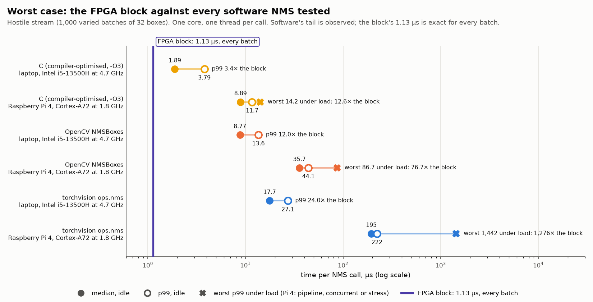
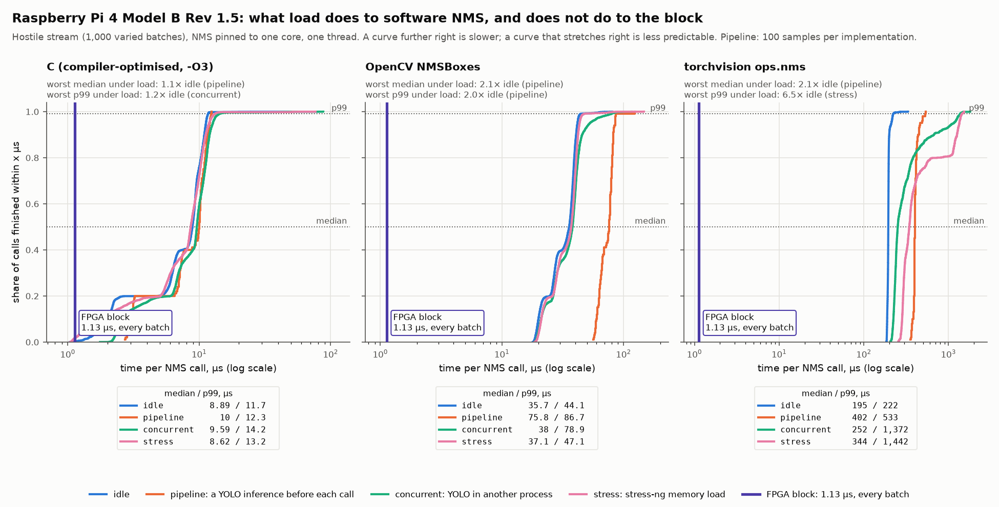
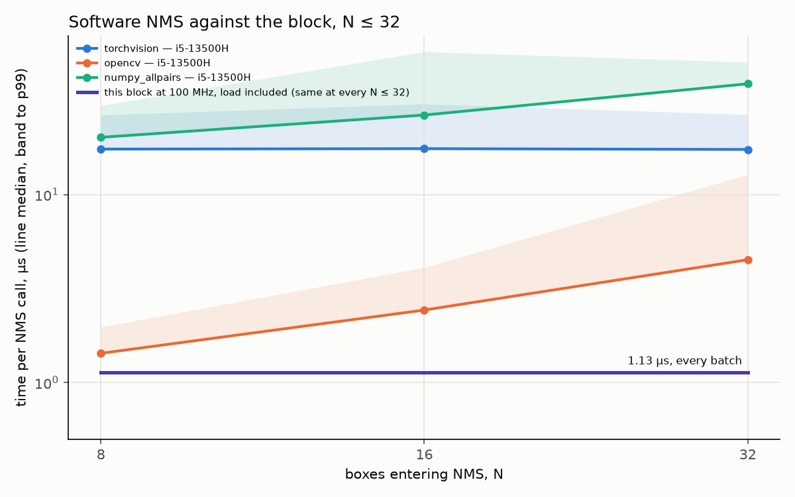

# NMS accelerator — benchmark report

How the FPGA NMS block compares with the software NMS that edge vision pipelines actually run:
what was measured, how, on which machines, and what the numbers do and do not support.

This document collects the Phase E evaluation ([plan.md](../project/plan.md), Phase E) in one place. The
raw results are committed under [benchmarks/results/](../../benchmarks/results/); the per-stage
narrative, including every bug found on the way, is in [build_log.md](../project/build_log.md); area and
timing of the RTL itself are in [hardware.md](hardware.md) §1–5. Every figure below is taken from
a committed result file, and each section names the file.

**Status (2026-09-29):** the block's latency is measured in simulation and on silicon; software
is measured on a laptop and on a Raspberry Pi 4, idle and under three kinds of load. Not yet
measured: the same RTL on other FPGA parts (E7), a literature comparison (E5), and a Pi 5 (§9).

---

## 1. Summary

**The block processes one batch of up to 32 boxes in a fixed 113 cycles, 1.13 µs at 100 MHz,
from the first record in to the result.** Of that, the 80-cycle compute (T) was captured on the
Basys 3 by an on-chip logic analyser, identical in 16 of 16 batches; the load and settle cycles
are pinned as equalities in simulation.

| hostile stream, median / p99 µs | laptop, idle | Pi 4, idle | Pi 4, pipeline | Pi 4, concurrent | Pi 4, stress |
|---|---|---|---|---|---|
| C, scalar (`-O3`, native) | **1.89** / 3.79 | 8.89 / 11.7 | 10.0 / 12.3 | 9.59 / 14.2 | 8.62 / 13.2 |
| OpenCV `cv2.dnn.NMSBoxes` | 8.77 / 13.6 | 35.7 / 44.1 | 75.8 / 86.7 | 38.0 / 78.9 | 37.1 / 47.1 |
| torchvision `ops.nms` | 17.7 / 27.1 | 195 / 222 | 402 / 533 | 252 / 1,372 | 344 / 1,442 |
| **the block, 100 MHz** | **1.13 / 1.13** | **1.13 / 1.13** | **1.13 / 1.13** | **1.13 / 1.13** | **1.13 / 1.13** |



What the evidence supports:

1. **Determinism, measured.** The block's time does not depend on the data or on what else the
   system is doing. Software's does: on the Pi 4 under load, torchvision's p99 reaches 5.5× its
   own median, and even plain C's worst call is ~80 µs against a 9 µs median.
2. **Against the libraries detection pipelines call, the block is 3–8× (laptop) and 16–67× (Pi 4)
   faster than OpenCV, and 14–16× (laptop) and 170–360× (Pi 4) faster than torchvision, on
   medians** — more on the tails under load (up to ~1,300× on torchvision's p99).
3. **Against hand-written C, it depends on the processor.** On a 4.7 GHz laptop core, C is
   *faster* than the block on every single batch tested (0.21–1.10 µs), and slower only on the
   hostile stream: 1.7× on its median and 3.4× on its p99. On the Pi 4's Cortex-A72, the block
   beats C on every input except one degenerate case (32 identical boxes, 1.02 µs).

What it does **not** support: any claim that the block, attached over the UART, speeds up a host
— the UART round trip is ~5 ms (§5.1). The block's case is as an in-fabric IP beside a
detector, where no link sits in between.

---

## 2. What is compared

### The block

`nms_core` on the Basys 3 (XC7A35T-1), 100 MHz, the shipped configuration: P = 16 IoU lanes,
`PIPE_CUTS` = 8, 2 issue registers. Every batch is 32 slots; absent slots are masked by
`present_mask`, so **the latency is the same for every N ≤ 32**.

| figure | cycles | at 100 MHz | how it is known |
|---|---|---|---|
| T, `start` → `done` | 80 | 0.80 µs | **on silicon** (ILA, 16/16 windows) and in simulation (every batch) |
| load: 32 records, one per cycle | 32 | 0.32 µs | simulation equality (`tb_nms_core`) |
| settle: the last box's area | 1 | 0.01 µs | simulation equality (`tb_nms_core`) |
| **full latency, first record in → `done`** | **113** | **1.13 µs** | the figure every software call is compared with |

The comparison uses the full 1.13 µs, not T: a library's NMS call includes getting its input
in, so the block's must too.

### Software

| name | what it is | why it is here |
|---|---|---|
| `c_scalar` | portable C, `-O3 -march=native` (x86) / `-mcpu=native` (ARM), no hand-written SIMD | the strongest software baseline: the fastest a plain CPU implementation gets |
| `opencv` | `cv2.dnn.NMSBoxes`, OpenCV 5.0, one thread | what OpenCV DNN deployments call |
| `torchvision` | `torchvision.ops.nms`, torch 2.14 (CPU build), one thread | what Ultralytics YOLO calls |
| `numpy_allpairs` | the golden model's all-pairs form in numpy | the fair upper bound for Python |
| `integer_sequential`, `integer_allpairs` | the golden model in pure Python | reference only |

The C variant is `benchmarks/c/nms_bench.c`; the Python ones are `models/nms/`. A hand-written
AVX2 variant was planned and dropped (2026-09-29), so the C figures are what the compiler makes
of portable code.

---

## 3. Method

### Inputs

Five input groups, each a batch or stream of 32-box batches in the frozen record format (12-bit
coordinates, 16-bit scores):

| group | what it is | stresses |
|---|---|---|
| `notebook32` | the project's original notebook batch | a typical mixed batch |
| `all_survive` | no pair overlaps enough to suppress | the most work for sequential code |
| `all_equal` | 32 identical boxes | the least: the first keeper suppresses everything |
| `rand_seed0` | a seeded random batch | an unremarkable batch |
| `hostile` | **1,000 batches, cycled**, from five generators (random with and without overlap, adversarial, low-resolution scores, all-equal) | the realistic mix; cycling means no repeated batch can flatter the branch predictor or cache |

The hostile stream is the headline input throughout: it is the only group that varies batch to
batch, as a real detector's output does.

### Correctness is checked before anything is timed

Every implementation runs every batch once, untimed, and is compared with a reference:
- **Our own variants** (C and Python) must equal the golden model `model.nms_sequential`
  **bit for bit**. They did, on every batch, on every machine.
- **The libraries** suppress when IoU **>** 0.5; the spec says **≥** ([architecture.md](../design/architecture.md)
  §5). They are checked against the same algorithm with `>`. Any remaining difference must have
  a named cause — tied scores, inverted boxes, or a pair exactly on the threshold — or the run
  fails. The only one seen: OpenCV breaks score ties differently on 173 of the 1,000 hostile
  batches (§6.5).

### Timing

- **Every call is timed on its own** and kept, and results are reported as min / median / p99 /
  max — never a mean. Idle groups take up to 5,000 samples or 0.5 s per group.
- **Inputs are prepared outside the timed region**, in each library's native format (tensors
  for torchvision, lists for OpenCV).
- **The C variant is timed inside C.** A Python → C call costs ~1 µs, which would swamp the
  answer, so each call reads the monotonic clock itself; the ctypes overhead falls outside. The
  cost of the two clock reads is recorded: 10 ns on the laptop, 37 ns on the Pi 4.
- **One CPU, one thread.** The process is pinned to CPU 2 (a P-core on the laptop) and each
  library to one thread, so the figure is one core's work.

### Load conditions (Pi 4)

| condition | what else is running | models |
|---|---|---|
| idle | nothing | the best case |
| **pipeline** | a YOLOv8n inference **before every timed call**, in the same process, on all four cores | **a real detection pipeline** — detect, then NMS, per frame; the main condition |
| concurrent | YOLOv8n continuously, in a second process, on the other three cores | another workload sharing the cache and memory |
| stress | two `stress-ng` memory workers on the other three cores | heavy memory contention |

### Validity and repeatability

Every result file records the commit, whether the tree was clean, CPU, clock, governor, library
versions and — on a Pi — `vcgencmd` temperature, clock and throttle flags before and after. **A
run is invalid if the Pi reports any throttle or under-voltage flag**, and is left out of every
table. Idle runs are repeated; **every median must agree within 10%**.

| machine | runs | valid | repeatability (idle, worst median difference) |
|---|---|---|---|
| laptop | 2 idle | 2 / 2 | 8.5% (torchvision); C and OpenCV within 6% |
| Pi 4 | 2 idle, pipeline, concurrent, stress | 5 / 5, never throttled (53–74 °C) | 4.4% |

---

## 4. Platforms

| | laptop | Raspberry Pi 4 | Basys 3 |
|---|---|---|---|
| processor | Intel i5-13500H, P-core | Broadcom BCM2711, **Cortex-A72** | AMD Artix-7 XC7A35T-1 |
| clock | 4.3–4.7 GHz turbo, `performance` governor | 1.8 GHz | 100 MHz |
| OS / toolchain | Ubuntu 24.04, gcc 13.3, Python 3.12 | Raspberry Pi OS 64-bit, gcc 14.2, Python 3.13 | Vivado 2026.1 (BASIC licence) |
| libraries | torch 2.14+cpu, torchvision 0.29, OpenCV 5.0.0, numpy 2.5 | same | — |
| results | `cpu-PoseidonD-2026-09-28-*` | `cpu-raspberrypi-2026-09-29-*` | `onchip-ila-2026-09-29.csv` |

The plan names a Raspberry Pi 5 (Cortex-A76) as the main competitor; it was not available. The
Pi 4's A72 is slower than the A76, so the Pi 4 comparison favours the block more than a Pi 5
would. It is, however, the class of ARM core that sits beside accelerators in edge SoCs.

The block's area on the XC7A35T: **12,570 LUT (60.4%), 9,979 FF (24.0%), 33 DSP, 0 BRAM**, meeting
100 MHz with +0.200 ns of setup slack ([hardware.md](hardware.md) §5).

---

## 5. Results — the block

### 5.1 Correct on silicon, and what the UART costs

The production bitstream, driven from the laptop over the board's USB-UART
([hardware.md](hardware.md) §6):

| check | result |
|---|---|
| 20 committed frames, byte-exact replies | 20 / 20 |
| random batches against the golden model | **1,000 / 1,000** bit-exact |
| corrupted frame rejected | yes (status `0x01`) |
| round trip, FTDI latency timer at 1 ms | min 3.47, **median 4.99**, p99 6.10, max 6.59 **ms** |

The round trip is a system measurement of the **test harness**: 264 + 6 bytes at 1 Mbaud is
2.70 ms of wire time alone, and USB polling adds the rest. The core's 1.13 µs is about 0.02% of
it. This is why the block is benchmarked as an in-fabric IP, not as a co-processor over a link.

### 5.2 T on silicon: 80 cycles, every batch

An Integrated Logic Analyzer on the core's handshake (a debug build, `make impl ILA=1`, which
also meets 100 MHz) captured 16 windows, one per random batch sent by the host. **Every window
measured `start` → `done` = 80 cycles = 800 ns, with `busy` high for exactly 80** — the same
count `tb_nms_core` pins in simulation. Sixteen different batches, one count: the data does not
change the latency.


`benchmarks/results/onchip-ila-2026-09-29.csv`; checked by `benchmarks/onchip_latency.py`.

---

## 6. Results — software

### 6.1 Laptop, idle (i5-13500H)

Median / p99 µs per call, `cpu-PoseidonD-2026-09-28-none`:

| implementation | notebook32 | all_survive | all_equal | rand_seed0 | hostile |
|---|---|---|---|---|---|
| C, scalar | **0.40** / 0.56 | 1.10 / 1.44 | **0.21** / 0.23 | 1.01 / 1.32 | 1.89 / 3.79 |
| OpenCV | 3.95 / 5.38 | 5.27 / 7.23 | 3.74 / 5.07 | 4.97 / 6.86 | 8.77 / 13.6 |
| torchvision | 15.5 / 21.2 | 16.1 / 21.8 | 15.3 / 24.6 | 15.9 / 23.0 | 17.7 / 27.1 |
| numpy all-pairs | 36.0 / 49.4 | 51.7 / 68.1 | 32.5 / 50.4 | 48.5 / 66.7 | 49.0 / 69.3 |
| Python, sequential | 75.3 / 103 | 433 / 502 | 40.6 / 58.9 | 337 / 438 | 323 / 559 |
| Python, all-pairs | 805 / 958 | 857 / 1,094 | 807 / 1,385 | 859 / 936 | 822 / 938 |
| **the block** | **1.13** | **1.13** | **1.13** | **1.13** | **1.13** |

### 6.2 Raspberry Pi 4, idle (Cortex-A72, 1.8 GHz)

Median / p99 µs per call, `cpu-raspberrypi-2026-09-29-none`:

| implementation | notebook32 | all_survive | all_equal | rand_seed0 | hostile |
|---|---|---|---|---|---|
| C, scalar | 2.11 / 2.15 | 7.39 / 7.43 | **1.02** / 1.04 | 6.52 / 6.56 | 8.89 / 11.7 |
| OpenCV | 19.0 / 19.6 | 30.4 / 32.1 | 17.9 / 18.7 | 27.6 / 28.9 | 35.7 / 44.1 |
| torchvision | 191 / 260 | 196 / 221 | 190 / 227 | 195 / 221 | 195 / 222 |
| numpy all-pairs | 306 / 335 | 449 / 470 | 271 / 314 | 417 / 443 | 425 / 482 |
| Python, sequential | 352 / 373 | 1,843 / 1,877 | 195 / 208 | 1,454 / 1,491 | 1,366 / 1,892 |
| Python, all-pairs | 3,538 / 3,595 | 3,618 / 3,654 | 3,642 / 3,707 | 3,682 / 3,727 | 3,601 / 3,752 |
| **the block** | **1.13** | **1.13** | **1.13** | **1.13** | **1.13** |

The same C is 4.7–6.7× slower on the Pi 4 than on the laptop.

### 6.3 Raspberry Pi 4, under load

Hostile stream, median / p99 / **max** µs:

| implementation | idle | pipeline | concurrent | stress |
|---|---|---|---|---|
| C, scalar | 8.89 / 11.7 / 82.1 | 10.0 / 12.3 / 12.4 | 9.59 / 14.2 / 87.9 | 8.62 / 13.2 / 76.8 |
| OpenCV | 35.7 / 44.1 / 80.7 | 75.8 / 86.7 / 124 | 38.0 / 78.9 / 117 | 37.1 / 47.1 / 147 |
| torchvision | 195 / 222 / 333 | 402 / 533 / 541 | 252 / 1,372 / 1,804 | 344 / 1,442 / 1,532 |
| numpy all-pairs | 425 / 482 / 557 | 676 / 757 / 765 | 585 / 1,164 / 1,620 | 1,346 / 1,699 / 1,835 |
| **the block** | **1.13 / 1.13 / 1.13** | **1.13** | **1.13** | **1.13** |



*Each curve is the cumulative distribution of one implementation's calls under one load: at
time x, the share of calls that had finished. The dotted guides read off the median (50%) and
p99 (99%); each panel's key gives them in numbers, and its subtitle names the worst shift under
load. The violet line is the block.*

Samples per figure: 5,000 for C and OpenCV under every load but pipeline; 350–2,300 for
torchvision and numpy (their calls are slower, and the budget is time); **100 under pipeline**
for every implementation (600 YOLO inferences took 9.6 minutes), where p99 is therefore the
second-highest value.

### 6.4 Batch size, N ≤ 32

The application guarantees at most 32 boxes reach NMS (§8), so the block's latency is flat over
the whole range while software grows with N. Real candidate sets: the top N YOLOv8n detections
of 50 COCO images (`benchmarks/results/feasibility/`).

| median µs | N = 8 | N = 16 | N = 32 |
|---|---|---|---|
| OpenCV, laptop | 1.43 | 2.43 | 4.50 |
| torchvision, laptop | 17.5 | 17.5 | 17.4 |
| OpenCV, Pi 4 | 7.72 | 11.4 | 20.4 |
| torchvision, Pi 4 | 189 | 192 | 195 |
| **the block** | **1.13** | **1.13** | **1.13** |



The laptop row of this sweep ran under the `powersave` governor, before the clock was fixed for
§6.1, so it is ~2× slower than §6.1's figures. The Pi 4 row ran unpinned. Both are context for
the shape of the curve, not reference timings.

### 6.5 Semantics: the libraries do not compute the spec

- **`>` against `≥`.** On **199 of the 1,000 hostile batches**, a library's `>` keeps a different
  set of boxes from the spec's `≥`. The hostile stream deliberately includes pairs exactly on
  the threshold, so real data would trigger this far less often — but it is a real difference,
  and the reason the spec pins `≥` and the RTL and golden model agree bit for bit.
- **Tie order.** OpenCV disagrees with the spec's lower-index-first tie rule on 173 hostile
  batches, all with tied scores. torchvision matches it everywhere. (The plan had assumed the
  opposite.)

---

## 7. The comparison, as ratios

**Block speedup = software median ÷ 1.13 µs** (p99 ÷ 1.13 µs in brackets). Above 1, the block is
faster; below 1, software is.

**Laptop, idle:**

| | notebook32 | all_survive | all_equal | rand_seed0 | hostile |
|---|---|---|---|---|---|
| C, scalar | **0.35** (0.5) | **0.97** (1.3) | **0.19** (0.2) | **0.90** (1.2) | 1.7 (3.4) |
| OpenCV | 3.5 (4.8) | 4.7 (6.4) | 3.3 (4.5) | 4.4 (6.1) | 7.8 (12.0) |
| torchvision | 13.7 (18.8) | 14.3 (19.3) | 13.5 (21.7) | 14.1 (20.4) | 15.6 (24.0) |

**Pi 4, idle:**

| | notebook32 | all_survive | all_equal | rand_seed0 | hostile |
|---|---|---|---|---|---|
| C, scalar | 1.9 (1.9) | 6.5 (6.6) | **0.90** (0.9) | 5.8 (5.8) | 7.9 (10.3) |
| OpenCV | 16.8 (17.4) | 26.9 (28.4) | 15.9 (16.5) | 24.5 (25.5) | 31.6 (39.1) |
| torchvision | 169 (230) | 173 (196) | 168 (201) | 172 (195) | 172 (197) |

**Pi 4, hostile stream, by load:**

| | idle | pipeline | concurrent | stress |
|---|---|---|---|---|
| C, scalar | 7.9 (10.3) | 8.9 (10.8) | 8.5 (12.6) | 7.6 (11.7) |
| OpenCV | 31.6 (39.1) | 67.1 (76.7) | 33.7 (69.8) | 32.9 (41.7) |
| torchvision | 172 (197) | 356 (472) | 223 (1,214) | 304 (1,276) |

**Spread, p99 ÷ median, hostile stream** — how unpredictable each is (the block: 1.00):

| | laptop idle | Pi 4 idle | Pi 4 pipeline | Pi 4 concurrent | Pi 4 stress |
|---|---|---|---|---|---|
| C, scalar | 2.01 | 1.31 | 1.22 | 1.48 | 1.53 |
| OpenCV | 1.55 | 1.24 | 1.14 | 2.07 | 1.27 |
| torchvision | 1.53 | 1.14 | 1.33 | **5.45** | **4.20** |

---

## 8. Context: how many boxes reach NMS

The block is fixed at N = 32. To check whether that meets a real need, YOLOv8n and YOLO11n were
run on 500 COCO val2017 images and the candidates entering NMS counted, per image and per
(image, class) — multi-class NMS runs one batch per class ([build_log.md](../project/build_log.md), E0).

| confidence > 0.25 | YOLOv8n | YOLO11n |
|---|---|---|
| boxes per (image, class) batch: median / p90 / p99 | 10 / 31 / 85 | 10 / 33 / 83 |
| batches with ≤ 32 boxes | 90.6% | 89.7% |
| keepers lost if every batch is cut to its top 32 | 11.4% | 10.9% |

On generic COCO scenes about 10% of batches exceed 32. The project's decision (2026-09-28) is that
the target is a special-purpose niche in which at most 32 boxes reach NMS, so **N ≤ 32 is an
application constraint, stated as an assumption**, not something COCO demonstrates.

---

## 9. Limitations

- **Pi 4, not Pi 5.** The planned main competitor was unavailable. A Pi 5's A76 would narrow the
  gaps in §6.2–6.3.
- **The block's full latency is half simulation.** T = 80 is measured on silicon; the 32 load
  cycles and 1 settle cycle are simulation equalities. Over the UART the board never receives
  32 records back to back, so only an in-fabric producer could show them on the chip.
- **The in-fabric argument is reasoned, not measured.** There is no Zynq or Kria board, so the
  claim that the block removes a DDR → interrupt → software round trip is argued, not shown.
- **One core, one thread, per call.** Multi-threading one 32-box NMS does not pay (the dispatch
  costs more than the work), but it is a stated choice.
- **Governor inconsistency on the Pi.** Idle and concurrent ran under `ondemand`, pipeline and
  stress under `performance`. The clock read 1.8 GHz in every run and idle repeated within 4.4%,
  so it held full speed, but the settings differ.
- **Pipeline samples are few** (100 per implementation); its p99 is the second-highest value.
- **Single class per batch**, and **N = 32 fixed** ([architecture.md](../design/architecture.md) §11).
- **YOLO and Ultralytics are AGPL-3.0**, used only as a benchmark load and not redistributed.

## 10. Not yet measured

| item | plan stage | needs |
|---|---|---|
| the same RTL on other parts: −2/−3 Artix, Zynq-7020, Kintex-7 — Fmax, area, T in ns | E7 | Vivado only (tooling built, `make parts`) |
| the lane-count curve P = 1…32 on the Basys 3 part | D2 | Vivado only (same tool) |
| published hardware NMS designs, normalised | E5 | literature |
| a Raspberry Pi 5 | E1/E2 | the board |
| the UART round trip at the FTDI default 16 ms timer | D3 | the board |

---

## 11. Reproducing

```bash
# software, on any Linux machine (x86 or 64-bit ARM); results -> benchmarks/results/
echo performance | sudo tee /sys/devices/system/cpu/cpu*/cpufreq/scaling_governor
make bench                                           # idle
make bench BENCH_ARGS="--tag run2"                   # the repeat
make bench LOAD=pipeline BENCH_ARGS="--cases hostile --frames 100"
make bench LOAD=concurrent
make bench LOAD=stress                               # needs stress-ng
make bench-report                                    # the tables
uv run --extra bench python -m benchmarks.report --compare-loads "Raspberry Pi 4" \
    docs/images/pi4_nms_by_load.png                  # the by-load figure
uv run --extra bench python -m benchmarks.report --headline \
    docs/images/headline_worst_case.png              # the worst-case figure
uv run --extra bench python -m benchmarks.feasibility.summarise \
    --dir benchmarks/results/feasibility --png docs/images/nms_time_vs_boxes.png

# the block, on a Basys 3 (Vivado on PATH)
make program && make host ARGS="--selftest --random 1000 --latency 500"
make impl ILA=1 && make ila                          # T on silicon
make program                                         # restore the production bitstream
```

Each command writes `<target>-<host>-<date>-<load>.{csv,json}` plus every raw sample, and exits
non-zero if any answer disagrees with its reference or a Pi throttled. The harness is described
in [plan.md](../project/plan.md) E.4; its tests are `benchmarks/test_*.py`.

## 12. Result files

| file | contents |
|---|---|
| `benchmarks/results/cpu-PoseidonD-2026-09-28-none{,-run2}.*` | laptop, idle, two runs |
| `benchmarks/results/cpu-raspberrypi-2026-09-29-none{,-run2}.*` | Pi 4, idle, two runs |
| `benchmarks/results/cpu-raspberrypi-2026-09-29-{pipeline,concurrent,stress}.*` | Pi 4 under load |
| `benchmarks/results/onchip-ila-2026-09-29.csv` | the ILA capture, 16 windows |
| `benchmarks/results/feasibility/counts_*.json` | COCO candidate counts |
| `benchmarks/results/feasibility/time_*` | software time against N |

Each `.csv` has one row per implementation and input group; the matching `.json` records the
machine, commit and validity; `-samples.csv.gz` holds every timed call.
