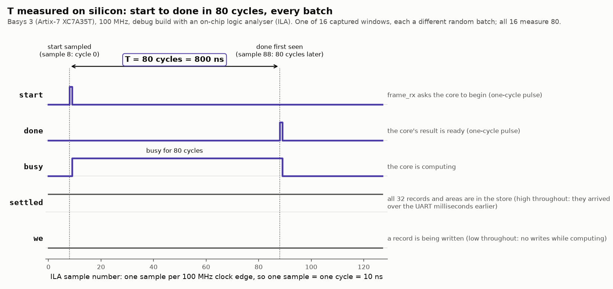

# Hardware results — area, timing, and the design on silicon

The measured counterpart to the estimates in [architecture.md](../design/architecture.md) §9. Every
figure here comes from the real part after full place and route — nothing is projected
unless it says so.

**Method.** `make synth MOD=<module>`, which runs [scripts/synth.tcl](../../scripts/synth.tcl):
out-of-context synthesis through `route_design` on `xc7a35tcpg236-1`, 10 ns constraint
unless stated, with **zero input and output delay against the clock on every data port**. Area is taken from `report_utilization` and timing from `get_timing_paths`.

Out-of-context is required, not a convenience: `bitonic32` presents 2 × 32 × 21 bits at its
boundary, which no 236-pin package can carry. Numbers are taken after routing rather than
after synthesis because a post-synthesis figure omits routing delay, and the 100 MHz claim is
about real Fmax.

Device totals for `xc7a35tcpg236-1`: **20,800 LUT, 41,600 FF, 90 DSP**.

Reports for the last run of each module land in `build/synth/<module>/`.

The comparison with software NMS is in [benchmarks.md](benchmarks.md); §5–6 here are the
hardware figures it cites.

> **Method correction (2026-09-24).** Before this date `synth.tcl` set only `create_clock`, so
> input-port → register and register → output-port paths were *unconstrained* and left out of
> WNS. That excluded `iou_lane`'s whole stage 1 and `bitonic32`'s first and last segments. The
> script now constrains every data port with a zero delay, which models each neighbour as a
> register at the boundary. The clocked figures below are re-measured under that rule. The
> earlier ones are kept in brackets where they differ. Area is unaffected by the change.

---

## 1. Per-module, measured

| module | LUT | % LUT | FF | CARRY4 | DSP | critical path | Fmax |
|---|---|---|---|---|---|---|---|
| `cas` (one unit) | 32 | 0.2% | 0 | 3 | 0 | 4.348 ns | 230.0 MHz |
| `bitonic32` (`PIPE_CUTS = 2`) | 9,596 | 46.1% | 1,344 | 720 | 0 | 18.570 ns | 53.9 MHz |
| `bitonic32` (`PIPE_CUTS = 8`) | 8,112 | 39.0% | 5,376 | 720 | 0 | 8.566 ns | 116.7 MHz *(119.2)* |
| `iou_lane` (one lane) | 109 | 0.5% | 101 | 30 | 2 | 7.161 ns | 139.6 MHz *(170.1)* |
| `nms_ctrl` (P = 16, C = 8) | 382 | 1.8% | 300 | 0 | 0 | 5.714 ns | 175.0 MHz |
| `box_store` (P = 16) | 1,602 | 7.7% | 2,822 | 10 | 1 | 7.355 ns | 136.0 MHz |
| **`nms_core`** (P = 16, C = 8, I = 2) — **whole compute core** | **12,384** | **59.5%** | **9,616** | 1,210 | **33** | 9.798 ns | **102.1 MHz** |
| **`nms_top`** — **board design, real pins, not out of context** | **12,570** | **60.4%** | **9,979** | — | **33** | 9.800 ns | **102.0 MHz**, hold +0.043 ns |

`iou_lane` at shipped generics (`T_INT = 128`, `K_SHIFT = 8`).

---

## 2. `bitonic32` across pipelining depth

| `PIPE_CUTS` | LUT | % LUT | LUT/CAS | FF | critical path | Fmax | meets 100 MHz |
|---|---|---|---|---|---|---|---|
| 2 (current default) | 9,596 | 46.1% | 40.0 | 1,344 | 18.570 ns | 53.9 MHz | no |
| 4 | 9,758 | 46.9% | 40.7 | 2,688 | 11.392 ns | 87.8 MHz | no |
| **8** | **8,112** | **39.0%** | 33.8 | 5,376 | 8.386 ns | **119.2 MHz** | **yes, WNS +1.614 ns** (re-measured with ports constrained: 116.7 MHz, +1.434 ns) |
| 15 | 7,680 | 36.9% | 32.0 | 10,080 | 5.335 ns | 187.4 MHz | yes |

**Pipelining reduces area here rather than costing it.** LUT is flat from 2 to 4 and then
falls 20% by 15, while Fmax rises 3.5×. Long combinational chains force logic replication;
cutting them lets the tool share instead. The flip-flops are the only real cost, and at
10,080 they are still 24% of those available.

**`PIPE_CUTS = 8` is the lowest swept value meeting 100 MHz**, and it is also cheaper in LUTs
than the current default of 2.

Two structural invariants hold at every point, which is what makes these numbers trustworthy
rather than a mis-elaboration: **CARRY4 = 720 = 240 × 3** always, and **FF = `PIPE_CUTS` × 672**
exactly (672 = 32 keys × 21 bits).

---

## 3. Estimated vs measured

Against the architecture.md §9 table. "16 × `iou_lane`" is one measured lane × 16; the lanes
are independent, so this scales cleanly.

| block | est. LUT | meas. LUT | est. FF | meas. FF | est. DSP | meas. DSP |
|---|---|---|---|---|---|---|
| `bitonic32` (`PIPE_CUTS = 2`) | 7,200 | 9,596 | 1,344 | 1,344 | 0 | 0 |
| `bitonic32` (`PIPE_CUTS = 8`) | — | 8,112 | — | 5,376 | — | 0 |
| 16 × `iou_lane` | 3,424 | 1,744 | ~2,400 | 1,616 | 16 | **32** |

**The per-CAS cost model is sound.** architecture.md and `cas.vhd` both predict
`8 + 2·⌈W/2⌉` = 30 LUT at W = 21. A standalone `cas` measures **32** — 6.7% over. In-network
the figure is higher and depends on pipelining (40.0 LUT/CAS at `PIPE_CUTS = 2`, converging
to 32.0 at 15, where it meets the standalone cost). The 7,200 LUT network total is met at
`PIPE_CUTS = 15` (7,680) and exceeded by 13% at the setting actually required.

**The flip-flop prediction for the sorter was exact** — 1,344 estimated, 1,344 measured.

**The lanes are half the estimated LUT cost** — 1,744 against 3,424.

**The lanes use twice the targeted DSPs.** 2 per lane, not 1, so 32 rather than 16. The cause
is known and was predicted in advance: `T_INT × U` is a constant multiply that was expected
to fold into shifts, and it did not. Vivado's log names both:

```
DSP Report: Generating DSP union, operation Mode is: C-(A2*B2)'.
DSP Report: Generating DSP s2_inter_reg, operation Mode is: (A2*B2)'.
```

Nothing structural is wrong — area and timing both pass comfortably — but recovering the fold
would halve the DSP budget. See the [build log](../project/build_log.md), the `iou_lane` synthesis entry.

---

## 4. Projected full-chip total

Measured where a block exists, architecture.md §9 estimate where it does not. Sorter at
`PIPE_CUTS = 8`, `P = 16`.

| block | LUT | FF | DSP | source |
|---|---|---|---|---|
| `bitonic32` (`PIPE_CUTS = 8`) | 8,112 | 5,376 | 0 | measured |
| 16 × `iou_lane` | 1,744 | 1,616 | 32 | measured |
| row-source payload mux | 530 | — | 0 | estimate |
| row-source area mux | 264 | — | 0 | estimate |
| payload/area/row/index registers | — | 3,050 | 1 | estimate |
| masks, resolve, FSM, UART | ~900 | ~450 | 0 | estimate |
| **projected total** | **≈11,550 (55.5%)** | **≈10,492 (25.2%)** | **33 (36.7%)** | |

**The design fits, with margin.** The two largest blocks are both measured rather than
guessed, and together they are **47.4% of LUTs and 35.6% of DSPs** — leaving over half the
device for everything still to be written. This settles `P = 16`, which was provisional until
these numbers existed.

The projected LUT total (55.5%) comes in *below* architecture.md's 59% estimate, because the
lanes undershot by more than the sorter overshot.

---

## 5. Timing

Every module that exists clears 100 MHz, with one configuration condition:

| module | Fmax | margin at 100 MHz |
|---|---|---|
| `bitonic32` (`PIPE_CUTS = 8`) | 116.7 MHz | WNS +1.434 ns |
| `iou_lane` | 139.6 MHz | WNS +2.839 ns |
| `cas` | 230.0 MHz | — |

**With port paths constrained, both modules still clear 100 MHz, but the margins shrink.**
- **`bitonic32`**: still limited by an internal two-sub-stage segment (after 10 → after 12).
  8.566 ns against 8.386 before is placement variation, so the port segments are not its
  critical path.
- **`iou_lane`**: now limited by **stage 1 from the input ports**, `k_a` → the DSP's
  synchronous-reset pin. Vivado folded the clamp into the multiplier's reset, so min/max,
  subtract and clamp all land in front of the DSP in one cycle.
- **The integration risk this exposes**: in the full design, the lane inputs are fed from
  `index_table` through a 32:1 × 72 b row-source mux whose selects fan out to 16 lanes. That
  mux has to fit in the lane's **2.84 ns of remaining slack**, which is tight.
- **If it misses at integration**, the fix is a registered keeper/candidate stage in the datapath. That
  is one more lane stage (`LANE_LATENCY` 5), which `nms_ctrl` absorbs through its generic,
  costing 1 cycle (T 78 → 79). See [fsm_design.md](../design/fsm_design.md) §9.

### The integrated row-source path will not close in one cycle

Now that every piece exists, the path from `nms_ctrl`'s counter to lane stage 1 can be added up
from measured segments, each timed with its ports constrained:

| segment | delay |
|---|---|
| `nms_ctrl`: `cnt` → `index_table` read → `row_src` | 5.714 ns (clock-to-out included) |
| `box_store`: row mux, `row_src` → `row_rec` / `row_area` | 3.951 ns |
| `box_store`: candidate mux, `col_grp` → `cand_*` | 2.099 ns (parallel, not additive) |
| `iou_lane`: stage 1, ports → DSP | 7.161 ns |
| **wired directly** | **≈ 16.8 ns against 10 ns** |

That sum predicted that integration would need register stages. **The integrated core measured it
on the placed design**, with
`ISSUE_REGS` as a generic of `nms_core`:

| `ISSUE_REGS` | T | WNS | Fmax | lane stage 1 slack | sorter slack | LUT | FF |
|---|---|---|---|---|---|---|---|
| 0 | 78 | **−4.886 ns** | 67.2 MHz | −4.886 ns (`index_table` → lane, 14.9 ns) | −1.202 ns | — | — |
| 1 | 79 | +0.087 ns | 100.9 MHz | +0.098 ns (from the payload register) | +0.087 ns | 12,402 | 9,599 |
| **2** | **80** | **+0.202 ns** | **102.1 MHz** | ≥ +0.202 ns | +0.202 ns | 12,384 | 9,616 |

Four findings:

1. **Registers are required.** With none, the path runs 14.9 ns and the core runs at 67 MHz. The
   16.8 ns sum of segments was pessimistic, because the tool optimises across block boundaries
   once the blocks are placed together, but the conclusion stands.
2. **`ISSUE_REGS = 2` ships** ([architecture.md](../design/architecture.md) §9). **T = 80 cycles =
   0.80 µs.** `nms_ctrl` absorbed the extra stages through its `LANE_LATENCY` generic with no
   logic change.
3. **The critical path moved to the sorter.** In context, `bitonic32`'s sub-stage 10 → 12
   segment takes 9.8 ns, against 8.57 ns alone. That is routing pressure at 59.5% LUT.
4. **Both margins are thin.** The sorter has +0.202 ns and the payload register → lane stage 1
   path has about +0.1 ns (that path now drives 16 lanes' worth of fan-out). Adding the UART for
   the board design will add routing pressure. Known remedies, in order of cost:
   - re-placing the sorter cuts through `CUT_AFTER`, or `PIPE_CUTS = 9`, which is +1 cycle;
   - duplicating the payload register to split the 16-lane fan-out;
   - a third issue stage, which is +1 cycle.

**Area came in as projected**: 12,384 LUT against the §4 projection of about 11,550 plus the
issue registers, and exactly 33 DSPs.

### The board design, with the UART, meets 100 MHz

`make impl` implements `nms_top` on the real part with `deployment/basys3.xdc` — real I/O,
not out of context — and writes a bitstream only if setup and hold both pass:

| | `nms_top` |
|---|---|
| setup | **WNS +0.200 ns**, 0 of 15,169 endpoints failing |
| hold | **WHS +0.043 ns**, 0 failing |
| area | 12,570 LUT (60.4%), 9,979 FF (24.0%), 33 DSP, 0 BRAM, 20 I/O |
| critical path | `bitonic32`, sub-stage 12 → 14 |
| bitstream | written, `build/impl/nms_top.bit` |

The risk carried out of the core integration did not materialise. The UART, frame parser and reply logic cost
about 190 LUT and moved the slack from +0.202 to +0.200 ns. The margin is still thin, and the
remedies above still apply if a later change eats it. `check_timing` lists 2 inputs and 17
outputs without delays; those are RsRx, btnC, RsTx and the LEDs, declared false paths in the
XDC by design.

The `PIPE_CUTS` sweep in §2 predates the method correction. Its internal-segment figures stand,
but the table has not been re-run with ports constrained.

**The weakest load-bearing estimate — the sorter's combinational timing — is settled, and it was pessimistic.**
It projected 22–37 ns / 27–45 MHz for the network combinationally; `PIPE_CUTS = 2` measures
18.570 ns / 53.9 MHz. Per sub-stage that is ~3.7 ns against the 1.5–2.5 ns assumed, but across
fewer levels in the critical segment than the estimate's arithmetic implied.

**The 100 MHz claim survives, at `PIPE_CUTS = 8` rather than the shipped 2.** `CLOCK_HZ` is
frozen at 100 MHz and `BAUD_DIV` derives from it, so this is a system constant rather than a
target, and it fixes the setting.

### Resolved: `PIPE_CUTS` is now 8

The constant moved from 2 to 8 in architecture.md §9, `params.py` and `nms_pkg.vhd` together, so
`test_params_agree` still holds. At 2 the sorter ran 53.9 MHz and did **not** meet the clock the
rest of the design assumes. The 6 extra cycles of sorter latency take architecture.md §9's
`T = N²/P + L + C + 2` from 72 to **78 cycles (0.78 µs)** at `P = 16`. The FSM design absorbs
them ([fsm_design.md](../design/fsm_design.md) §6). Correctness at 8 is verified: the sorter testbench checked every
`PIPE_CUTS` from 0 to 15, and `tb_bitonic32` now runs at 8 in the standing regression.

---

## 6. On the board

The board-design bitstream (`build/impl/nms_top.bit`: P = 16, `PIPE_CUTS` = 8, I = 2) was run on a Basys 3
on 2026-09-28 and checked from the host over the FT2232HQ UART with `make host`
([build log](../project/build_log.md), the first board run). No RTL or host change was needed.

| check | result |
|---|---|
| `--selftest` | **20/20** committed frames byte-exact, including every edge case |
| `--crc-test` | pass: status `0x01`, mask `0x00000000` |
| `--random 1000` | **1000/1000** batches bit-exact against the golden model |

**Round trip**, `--latency 500`, FTDI latency timer at 1 ms:

| min | median | p99 | max | wire time alone |
|---|---|---|---|---|
| 3.468 ms | **4.987 ms** | 6.102 ms | 6.591 ms | 2.70 ms |

The core takes 0.80 µs of this, about 0.02%, which is below the resolution of the measurement.
The excess over wire time is on the host side: USB full-speed polling, the FTDI latency timer and
OS scheduling. That is inferred, not separately measured. The figure measures the test harness
and not the accelerator, as [architecture.md](../design/architecture.md) §11 says it would.

**T = 80 cycles, measured on silicon.** An ILA on the core's handshake (a debug build, `make
impl ILA=1`, +0.245 ns slack) captured 16 windows on the Basys 3 on 2026-09-29, one per random
batch sent by the host. **Every window measured `start` → `done` = 80 cycles = 800 ns**, and
`busy` was high for exactly 80. The count was the same for 16 different batches, so the
latency's independence from the data is shown on the chip, not only in simulation. It is
exactly the count `tb_nms_core` pins.
([benchmarks/results/onchip-ila-2026-09-29.csv](../../benchmarks/results/onchip-ila-2026-09-29.csv),
[images/onchip_latency.png](../images/onchip_latency.png).)



**The core's full latency, from the first record in to `done`, is 113 cycles = 1.13 µs:**
32 load cycles, 1 settle cycle for the last box's area, and T = 80. `tb_nms_core` pins each
part as an equality on every batch, in simulation ([build_log.md](../project/build_log.md), "Full
latency, pinned"). It is the figure a whole software NMS call is compared with. Of its three
parts, T is now also measured on silicon (above). The 32 load cycles and the 1 settle cycle
remain simulation figures: over the UART the records arrive milliseconds apart, so the board
never loads 32 back to back.

**Still not measured:**
- the round trip at the FTDI default 16 ms timer (reproduce with
  `make host ARGS="--latency 500 --leave-latency-timer"` after resetting the timer);

---

## 7. Software comparison

The comparison with software NMS — a laptop and a Raspberry Pi 4, idle and under load — is in
[benchmarks.md](benchmarks.md). This document holds the hardware measurements it relies on.
